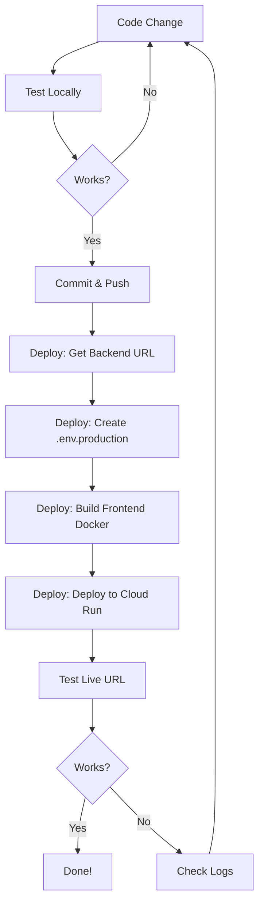

# 🐛 Cloud Deployment Issue - Root Cause Analysis

## The Problem

When deploying to Google Cloud Run after adding the blog feature, the deployment failed with:

```
ERROR: (gcloud.builds.submit) INVALID_ARGUMENT: generic::invalid_argument: 
key "_VITE_API_URL" in the substitution data is not matched in the template
```

The frontend showed a blank page at: https://aqi-frontend-ezhjyyateq-uc.a.run.app/

---

## 🔍 Root Cause

### What We Expected
"If it works locally, it should work in the cloud" - because we set up environment variables properly.

### What Actually Happened
The `deploy.sh` script had **inconsistent deployment logic**:

**Backend (✅ Correct):**
```bash
# Uses cloudbuild.yaml
gcloud builds submit --config cloudbuild.yaml
```

**Frontend (❌ Wrong):**
```bash
# Tried to use substitutions without proper Dockerfile build-arg handling
gcloud builds submit \
    --tag gcr.io/$PROJECT_ID/$FRONTEND_SERVICE \
    --substitutions=_VITE_API_URL="$BACKEND_URL"  # This doesn't work!
```

---

## 🎯 The Core Issue

### Problem #1: Substitutions vs Build Args

**Substitutions** (`--substitutions`) are for Cloud Build's `cloudbuild.yaml` templates.  
**Build Args** (`--build-arg`) are for Docker's Dockerfile `ARG` instructions.

Our `deploy.sh` was mixing them up!

```bash
# What we tried (WRONG):
gcloud builds submit --substitutions=_VITE_API_URL="$URL"

# What we needed (CORRECT):
gcloud builds submit --build-arg VITE_API_URL="$URL"
```

### Problem #2: Environment Variable Timing

**Vite (our frontend build tool)** reads `VITE_*` environment variables **at build time**, not runtime!

```javascript
// This is evaluated during `npm run build`, not when the app runs!
const API_URL = import.meta.env.VITE_API_URL
```

So we need to:
1. Create `.env.production` with the backend URL
2. Build the frontend (Vite reads the .env file)
3. The built static files have the URL baked in

---

## 🔧 The Fix

### Updated `deploy.sh`:

```bash
# 1. Get backend URL
BACKEND_URL=$(gcloud run services describe $BACKEND_SERVICE ...)

# 2. Create .env.production for Vite to read during build
echo "VITE_API_URL=$BACKEND_URL" > frontend/.env.production

# 3. Build Docker image (Dockerfile will use this during npm run build)
cd frontend
gcloud builds submit --tag gcr.io/$PROJECT_ID/$FRONTEND_SERVICE

# 4. Deploy to Cloud Run
gcloud run deploy $FRONTEND_SERVICE --image gcr.io/...
```

### How It Works Now:

```
deploy.sh runs
    ↓
Gets backend URL from Cloud Run
    ↓
Creates frontend/.env.production with VITE_API_URL=https://backend-url
    ↓
Builds Docker image
    ↓
Dockerfile copies .env.production
    ↓
npm run build reads VITE_API_URL from .env.production
    ↓
Built files have correct backend URL hardcoded
    ↓
Deploys to Cloud Run ✅
```

---

## 🤔 Why This Wasn't Caught Locally

### Local Development (Works):
```bash
# .env file exists
VITE_API_URL=http://localhost:8000

# Vite dev server reads it
npm run dev
```

### Cloud Deployment (Broke):
```bash
# No .env.production file
# Vite build uses fallback or undefined
# Result: Frontend can't find backend!
```

---

## 📋 What Was Missing in Our Setup

Our environment guide covered:
1. ✅ How to use `.env` files locally
2. ✅ How environment variables work
3. ❌ **How Vite build-time variables differ from runtime variables**
4. ❌ **That deployment scripts need to create .env.production**

### The Gap

**We assumed:** Environment variables are set at runtime (like in backend Python)

**Reality for Vite:** Environment variables are baked in at **build time**

This is a critical difference between:
- **Backend (Python)**: `os.environ.get("PORT")` - read at runtime
- **Frontend (Vite)**: `import.meta.env.VITE_API_URL` - read at build time

---

## ✅ Corrected Workflow

### Local Development
```bash
# .env exists with localhost URLs
.\start.bat
# Works! ✅
```

### Cloud Deployment
```bash
# deploy.sh now:
# 1. Gets backend URL
# 2. Creates .env.production with it
# 3. Builds frontend (reads .env.production)
# 4. Deploys

./deploy.sh
# Works! ✅
```

---

## 🎓 Key Lessons

### 1. Build-Time vs Runtime Variables

| Type | When Read | Example |
|------|-----------|---------|
| **Runtime** | When app runs | Python `os.environ.get("PORT")` |
| **Build-Time** | During `npm run build` | Vite `import.meta.env.VITE_API_URL` |

**Impact:** Build-time variables must be set BEFORE building, not during deployment.

### 2. Deployment Scripts Must Match Environment

Our `deploy.sh` must:
- ✅ Get dynamic values (backend URL)
- ✅ Create `.env.production` with them
- ✅ Build with those values
- ✅ Deploy the result

### 3. Docker Build Args vs Cloud Build Substitutions

| Mechanism | Used For | Syntax |
|-----------|----------|--------|
| **Build Args** | Dockerfile `ARG` | `--build-arg KEY=value` |
| **Substitutions** | cloudbuild.yaml `${}` | `--substitutions=_KEY=value` |

Don't mix them!

---

## 🚀 Updated Best Practices

### For Adding Features:

1. **Develop Locally**
   ```bash
   # Edit code
   .\start.bat
   # Test at localhost
   ```

2. **Test Docker Build Locally** (NEW!)
   ```bash
   # Create .env.production
   echo "VITE_API_URL=http://localhost:8000" > frontend/.env.production
   
   # Build Docker image
   docker build -t test-frontend ./frontend
   
   # Run it
   docker run -p 8080:8080 test-frontend
   ```

3. **Commit and Deploy**
   ```bash
   git commit -am "feat: Your feature"
   git push origin google-cloud-run
   
   # In Cloud Shell
   ./deploy.sh
   ```

### For Environment Variables:

**Backend (Runtime variables):**
```python
# Can be set at deployment time
port = int(os.environ.get("PORT", 8000))
```

**Frontend (Build-time variables):**
```javascript
// Must be set BEFORE building
const API_URL = import.meta.env.VITE_API_URL
```

**Deployment script must:**
```bash
# Create .env.production BEFORE building
echo "VITE_API_URL=$BACKEND_URL" > frontend/.env.production
# Then build
npm run build
```

---

## 🔄 Complete Fixed Workflow



---

## 📝 Summary

**Root Cause:**  
Vite requires environment variables at **build time**, not runtime. Our `deploy.sh` wasn't creating `.env.production` before building.

**The Fix:**  
Modified `deploy.sh` to:
1. Get backend URL from Cloud Run
2. Create `frontend/.env.production` with `VITE_API_URL`
3. Build Docker image (which runs `npm run build`, reading the .env file)
4. Deploy the built image

**Lesson Learned:**  
"Works locally" ≠ "Works in cloud" when build processes differ. Always test the deployment process, not just the running application.

**Prevention:**  
Understand the difference between build-time and runtime environment variables. Document this in your team's workflow guide.

---

## ✅ Verification Checklist

After the fix, verify:

- [ ] `deploy.sh` creates `.env.production`
- [ ] Frontend build includes backend URL
- [ ] Cloud Run frontend can reach backend
- [ ] Navigation between Calculator and Blog works
- [ ] No console errors in browser DevTools
- [ ] Blog posts display correctly

Your deployment should now work as expected! 🎉
