# 🚀 Deployment Guide - Google Cloud Run

Deploy your AQI Calculator to Google Cloud Run for production use!

---

## 📋 Table of Contents

1. [Overview](#-overview)
2. [Prerequisites](#-prerequisites)
3. [Quick Deploy](#-quick-deploy-automated)
4. [Manual Deployment](#-manual-deployment-step-by-step)
5. [Testing Locally on Cloud VM](#-testing-locally-on-cloud-vm)
6. [Configuration](#-configuration)
7. [Troubleshooting](#-troubleshooting)
8. [Cost Estimates](#-cost-estimates)

---

## 🗺️ Overview

Google Cloud Run is a fully managed serverless platform that automatically scales your containers.


**Architecture after deployment:**

| Component | Local URL | Cloud Run URL (example) |
|-----------|-----------|-------------------------|
| Frontend | localhost:3000 | aqi-frontend-abc123.us-central1.run.app |
| Backend | localhost:8000 | aqi-backend-abc123.us-central1.run.app |

---

## 📋 Prerequisites

### 1. Google Cloud Account
- Create account at [cloud.google.com](https://cloud.google.com)
- Free tier includes $300 credit for new users

### 2. Google Cloud Project
- Create a new project or use existing one
- Note your **Project ID** (not project name)

### 3. Enable Billing
- Required even for free tier usage
- Go to: Billing > Link a billing account

---

## 🚀 Quick Deploy (Automated)

The fastest way to deploy using Cloud Shell:

### Step 1: Open Cloud Shell

1. Go to [console.cloud.google.com](https://console.cloud.google.com)
2. Click the **Cloud Shell** icon (>_) in the top right
3. Wait for the shell to initialize

### Step 2: Clone and Deploy

```bash
# Clone your repository
git clone https://github.com/YOUR_USERNAME/aqi-calculator.git
cd aqi-calculator

# Checkout the Cloud Run branch
git checkout google-cloud-run

# Set your project (replace with your project ID)
gcloud config set project YOUR_PROJECT_ID

# Make deploy script executable and run
chmod +x deploy.sh
./deploy.sh
```

### Step 3: Access Your App

After deployment, you'll see URLs like:
```
Frontend URL: https://aqi-frontend-abc123-uc.a.run.app
Backend URL:  https://aqi-backend-abc123-uc.a.run.app
```

Visit the Frontend URL to use your app!

---

## 📝 Manual Deployment (Step-by-Step)

For learning or debugging, deploy each component manually:

### Step 1: Enable Required APIs

```bash
gcloud services enable cloudbuild.googleapis.com
gcloud services enable run.googleapis.com
gcloud services enable containerregistry.googleapis.com
```

### Step 2: Set Variables

```bash
export PROJECT_ID=$(gcloud config get-value project)
export REGION=us-central1
```

### Step 3: Build and Deploy Backend

```bash
# Build the Docker image
cd backend
gcloud builds submit --tag gcr.io/$PROJECT_ID/aqi-backend

# Deploy to Cloud Run
gcloud run deploy aqi-backend \
    --image gcr.io/$PROJECT_ID/aqi-backend \
    --region $REGION \
    --platform managed \
    --allow-unauthenticated \
    --port 8080

# Get the backend URL
BACKEND_URL=$(gcloud run services describe aqi-backend \
    --region=$REGION --format='value(status.url)')
echo "Backend URL: $BACKEND_URL"
```

### Step 4: Build and Deploy Frontend

```bash
cd ../frontend

# Build with backend URL baked in
gcloud builds submit \
    --tag gcr.io/$PROJECT_ID/aqi-frontend \
    --substitutions=_VITE_API_URL="$BACKEND_URL"

# Or use Docker directly:
# docker build --build-arg VITE_API_URL=$BACKEND_URL -t gcr.io/$PROJECT_ID/aqi-frontend .
# docker push gcr.io/$PROJECT_ID/aqi-frontend

# Deploy to Cloud Run
gcloud run deploy aqi-frontend \
    --image gcr.io/$PROJECT_ID/aqi-frontend \
    --region $REGION \
    --platform managed \
    --allow-unauthenticated \
    --port 8080

# Get the frontend URL
FRONTEND_URL=$(gcloud run services describe aqi-frontend \
    --region=$REGION --format='value(status.url)')
echo "Frontend URL: $FRONTEND_URL"
```

### Step 5: Update Backend CORS (Optional)

For production, update CORS in `backend/main.py`:

```python
app.add_middleware(
    CORSMiddleware,
    allow_origins=[
        "http://localhost:3000",
        "https://aqi-frontend-xxx.us-central1.run.app",  # Your frontend URL
    ],
    allow_credentials=True,
    allow_methods=["*"],
    allow_headers=["*"],
)
```

Then redeploy the backend.

---

## 🖥️ Testing Locally on Cloud VM

Before deploying to Cloud Run, test locally in Cloud Shell:

### Test Backend

```bash
cd backend

# Create virtual environment
python3 -m venv .venv
source .venv/bin/activate

# Install dependencies
pip install -r requirements.txt

# Run the server
python main.py
```

Click **Web Preview** (eye icon) > **Preview on port 8000** to test the API.

### Test Frontend

```bash
cd frontend

# Install dependencies
npm install

# Run development server
npm run dev -- --host
```

Click **Web Preview** > **Preview on port 3000** to test the frontend.

### Test with Docker (Recommended)

```bash
# Test backend container
cd backend
docker build -t aqi-backend .
docker run -p 8080:8080 aqi-backend

# Test frontend container (in another terminal)
cd frontend
docker build --build-arg VITE_API_URL=http://localhost:8080 -t aqi-frontend .
docker run -p 3000:8080 aqi-frontend
```

---

## ⚙️ Configuration

### Environment Variables

| Variable | Where | Description |
|----------|-------|-------------|
| `PORT` | Cloud Run (auto) | Container port (don't set manually) |
| `VITE_API_URL` | Frontend build | Backend URL for API calls |
| `PROJECT_ID` | gcloud config | Your GCP project ID |
| `REGION` | Deploy command | Cloud Run region (e.g., us-central1) |

### Regions

Available Cloud Run regions:
- `us-central1` (Iowa) - recommended for US
- `us-east1` (South Carolina)
- `europe-west1` (Belgium)
- `asia-east1` (Taiwan)

See full list: [Cloud Run Locations](https://cloud.google.com/run/docs/locations)

### Scaling Configuration

Cloud Run scales automatically. To customize:

```bash
gcloud run deploy aqi-backend \
    --image gcr.io/$PROJECT_ID/aqi-backend \
    --region $REGION \
    --min-instances 0 \
    --max-instances 10 \
    --memory 256Mi \
    --cpu 1
```

---

## 🐛 Troubleshooting

### Issue: "Permission denied" on deploy script

```bash
chmod +x deploy.sh
./deploy.sh
```

### Issue: "Project not set"

```bash
gcloud config set project YOUR_PROJECT_ID
```

### Issue: "APIs not enabled"

```bash
gcloud services enable cloudbuild.googleapis.com run.googleapis.com containerregistry.googleapis.com
```

### Issue: Container fails to start

Check logs:
```bash
gcloud run services logs read aqi-backend --region=us-central1
gcloud run services logs read aqi-frontend --region=us-central1
```

### Issue: CORS errors

1. Check if backend URL is correct in frontend build
2. Update CORS origins in backend to include your frontend URL
3. Redeploy backend after CORS changes

### Issue: "Failed to fetch" in browser

1. Open browser DevTools (F12) > Network tab
2. Check if API request URL is correct
3. Verify backend is running: `curl $BACKEND_URL/health`

### View Logs

```bash
# Stream logs in real-time
gcloud run services logs tail aqi-backend --region=us-central1

# View recent logs
gcloud run services logs read aqi-backend --region=us-central1 --limit=100
```

---

## 💰 Cost Estimates

Cloud Run has a generous free tier:

| Resource | Free Tier (per month) |
|----------|----------------------|
| Requests | 2 million |
| CPU | 180,000 vCPU-seconds |
| Memory | 360,000 GiB-seconds |
| Networking | 1 GB egress |

**For a small project like this AQI Calculator:**
- Likely **$0/month** with normal usage
- Scales to zero when not in use
- Only pay when requests come in

### Cost Optimization Tips

1. Set `--min-instances 0` to scale to zero
2. Use `--memory 256Mi` (minimum needed)
3. Choose a region close to your users

---

## 📁 Project Structure for Cloud Run

```
aqi-calculator/
├── backend/
│   ├── Dockerfile          # Backend container config
│   ├── .dockerignore       # Files to exclude from build
│   ├── main.py             # FastAPI application
│   ├── aqi_calculator.py   # AQI calculation logic
│   └── requirements.txt    # Python dependencies
├── frontend/
│   ├── Dockerfile          # Frontend container config
│   ├── .dockerignore       # Files to exclude from build
│   ├── nginx.conf          # Nginx server config
│   ├── docker-entrypoint.sh # Container startup script
│   ├── package.json        # Node dependencies
│   └── src/                # React source code
├── cloudbuild.yaml         # Cloud Build automation
├── deploy.sh               # Quick deploy script
├── deploy-manual.sh        # Step-by-step deploy guide
└── DEPLOYMENT.md           # This file
```

---

## ✅ Deployment Checklist

- [ ] Google Cloud project created
- [ ] Billing enabled (free tier is fine)
- [ ] Repository cloned in Cloud Shell
- [ ] On `google-cloud-run` branch
- [ ] Project ID configured: `gcloud config set project YOUR_ID`
- [ ] Deploy script run: `./deploy.sh`
- [ ] Frontend URL works in browser
- [ ] API health check passes: `curl $BACKEND_URL/health`

---

## 🎉 Success!

Your AQI Calculator is now live on Google Cloud Run!

```mermaid
flowchart LR
    A[👤 Anyone] -->|Visits| B[your-frontend.run.app]
    B -->|API Call| C[your-backend.run.app]
    C -->|Response| B
    B --> D[🌍 Works Worldwide!]
```



### Next Steps

- 🔗 Set up a custom domain
- 📊 Add Cloud Monitoring for metrics
- 🔐 Add authentication with Firebase Auth
- 🔄 Set up CI/CD with Cloud Build triggers

---

## 📚 Resources

- [Cloud Run Documentation](https://cloud.google.com/run/docs)
- [Cloud Build Documentation](https://cloud.google.com/build/docs)
- [Pricing Calculator](https://cloud.google.com/products/calculator)
- [FastAPI on Cloud Run](https://cloud.google.com/run/docs/quickstarts/build-and-deploy/deploy-python-service)

---

**Happy deploying! 🚀☁️**
