# 🚀 Deployment Guide - Google Cloud Run

Put your AQI Calculator on the internet so anyone can use it!

---

## 📚 Table of Contents

1. [What is Google Cloud Run?](#what-is-google-cloud-run)
2. [Prerequisites](#prerequisites)
3. [Quick Deploy](#quick-deploy-5-minutes)
4. [Manual Deploy](#manual-deploy-for-learning)
5. [How It Works](#how-it-works)
6. [Making Updates](#making-updates)
7. [Troubleshooting](#troubleshooting)
8. [Cost](#cost)

---

## What is Google Cloud Run?

Google Cloud Run is a **serverless** platform that runs your app in containers. Think of it as "upload your code, get a URL."

```mermaid
graph LR
    subgraph "🏠 Local Development"
        L1["localhost:3000<br/>(frontend)"]
        L2["localhost:8000<br/>(backend)"]
    end
    
    subgraph "☁️ Google Cloud Run"
        C1["https://aqi-frontend-xxx.run.app"]
        C2["https://aqi-backend-xxx.run.app"]
    end
    
    L1 --> |"deploy"| C1
    L2 --> |"deploy"| C2
```



### Why Cloud Run?

| Feature | What it means |
|---------|---------------|
| ✅ **Auto-scaling** | 0 users → 0 cost, 1000 users → auto handles it |
| ✅ **HTTPS included** | Secure URLs automatically |
| ✅ **Pay per use** | Only charged when someone uses your app |
| ✅ **Free tier** | 2 million requests/month free |

---

## Prerequisites

### 1. Google Cloud Account
- Create at [cloud.google.com](https://cloud.google.com)
- New users get **$300 free credit** for 90 days!

### 2. Google Cloud Project


1. Go to [Google Cloud Console](https://console.cloud.google.com)
2. Click project dropdown → **New Project**
3. Name it (e.g., `aqi-calculator`)
4. Note your **Project ID** (you'll need it!)

### 3. Enable Billing
- Required even with free tier
- Go to: **Billing** → **Link a billing account**
- Don't worry: this app costs ~$0-2/month with normal usage

### 4. Google Analytics (Optional)
- The app includes Google Analytics tracking (ID: G-5P95TPMZ43)
- Integrated in `frontend/index.html` to monitor usage and performance
- No additional configuration needed for deployment

---

## Quick Deploy (5 Minutes)

### The Deployment Flow

```mermaid
sequenceDiagram
    participant You
    participant CloudShell as Cloud Shell
    participant CloudBuild as Cloud Build
    participant CloudRun as Cloud Run
    
    You->>CloudShell: Open terminal in browser
    You->>CloudShell: Clone repo + set API keys
    You->>CloudShell: Run ./deploy.sh
    
    CloudShell->>CloudBuild: Build backend Docker image
    CloudBuild->>CloudRun: Deploy backend
    CloudRun-->>CloudShell: Backend URL
    
    CloudShell->>CloudBuild: Build frontend (with backend URL)
    CloudBuild->>CloudRun: Deploy frontend
    CloudRun-->>You: 🎉 Frontend URL - Your app is live!
```



### Step 1: Open Cloud Shell

1. Go to [console.cloud.google.com](https://console.cloud.google.com)
2. Click the terminal icon **>_** in the top right corner
3. Wait for the shell to load (it's a full Linux terminal in your browser!)

### Step 2: Get Your Code

```bash
# Clone your repository
git clone https://github.com/theaiguy1987/aqi_app.git
cd aqi_app

# Switch to deployment branch (if applicable)
git checkout google-cloud-run

# Set your project ID (replace with yours!)
gcloud config set project YOUR_PROJECT_ID
```

### Step 3: Set Up API Keys

```bash
# Required: AQICN token for air quality data
export AQICN_API_TOKEN=your_token_here

# Optional: Google Maps for location autocomplete
export GOOGLE_MAPS_API_KEY=your_key_here
```

> 🔑 Get your AQICN token at [aqicn.org/data-platform/token](https://aqicn.org/data-platform/token/)

### Step 4: Deploy!

```bash
# Make script executable
chmod +x deploy.sh

# Run deployment
./deploy.sh
```

**Wait 5-10 minutes.** When done, you'll see:
```
==========================================
🎉 Deployment Complete!
==========================================
Frontend: https://aqi-frontend-xxx-uc.a.run.app
Backend:  https://aqi-backend-xxx-uc.a.run.app
==========================================
```

### Step 5: Test It!

Open the **Frontend URL** in your browser. Your app is live on the internet! 🎉

---

## Manual Deploy (For Learning)

If you want to understand each step:

### Step 1: Enable APIs

```bash
gcloud services enable \
    cloudbuild.googleapis.com \
    run.googleapis.com \
    containerregistry.googleapis.com
```

### Step 2: Set Variables

```bash
export PROJECT_ID=$(gcloud config get-value project)
export REGION=us-central1
```

### Step 3: Deploy Backend

```bash
cd backend

# Build Docker image
gcloud builds submit --tag gcr.io/$PROJECT_ID/aqi-backend

# Deploy to Cloud Run (with AQICN API token)
gcloud run deploy aqi-backend \
    --image gcr.io/$PROJECT_ID/aqi-backend \
    --region $REGION \
    --platform managed \
    --allow-unauthenticated \
    --port 8080 \
    --set-env-vars "AQICN_API_TOKEN=your_aqicn_token_here"

# Get the URL
BACKEND_URL=$(gcloud run services describe aqi-backend --region=$REGION --format='value(status.url)')
echo "Backend: $BACKEND_URL"
```

**Note:** Get your free AQICN API token at [aqicn.org/data-platform/token](https://aqicn.org/data-platform/token/)

### Step 4: Deploy Frontend

```bash
cd ../frontend

# Create environment file with backend URL and Google Maps API key
echo "VITE_API_URL=$BACKEND_URL" > .env.production
echo "VITE_GOOGLE_MAPS_API_KEY=your_google_maps_key_here" >> .env.production

# Build Docker image
gcloud builds submit --tag gcr.io/$PROJECT_ID/aqi-frontend

# Deploy to Cloud Run
gcloud run deploy aqi-frontend \
    --image gcr.io/$PROJECT_ID/aqi-frontend \
    --region $REGION \
    --platform managed \
    --allow-unauthenticated \
    --port 8080

# Get the URL
FRONTEND_URL=$(gcloud run services describe aqi-frontend --region=$REGION --format='value(status.url)')
echo "Frontend: $FRONTEND_URL"
```

> 💡 **Google Maps API**: If you skip `VITE_GOOGLE_MAPS_API_KEY`, location autocomplete won't work, but users can still use GPS.

---

## How It Works

### Understanding the Deployment Pipeline


### Build-Time vs Runtime Variables

This is **critical** to understand:


**Why this matters:**
- Backend can change env vars anytime
- Frontend env vars must be set **BEFORE** building the Docker image

That's why `deploy.sh`:
1. Deploys backend first
2. Gets backend URL
3. Creates `.env.production` with backend URL
4. THEN builds frontend

---

## Making Updates

### Your Update Workflow

```mermaid
flowchart LR
    A["1️⃣ Edit code locally"] --> B["2️⃣ Test with start.bat"]
    B --> C["3️⃣ git commit & push"]
    C --> D["4️⃣ Run deploy.sh<br/>in Cloud Shell"]
    D --> E["5️⃣ App updated! 🎉"]
```



```bash
# 1. Make changes locally
code .

# 2. Test locally
.\start.bat

# 3. Commit and push
git add .
git commit -m "feat: Your change"
git push

# 4. Deploy (in Cloud Shell)
cd ~/aqi_app
git pull
./deploy.sh
```

### What's Safe to Change?

| ✅ Safe to Change | ⚠️ Be Careful | 🚨 Expert Only |
|-------------------|---------------|----------------|
| Python logic | requirements.txt | Dockerfile |
| React components | package.json | nginx.conf |
| CSS/Tailwind | API endpoints | cloudbuild.yaml |
| Static text | Environment vars | deploy.sh |

---

## Troubleshooting

### Common Issues & Solutions

```mermaid
flowchart TD
    A["🚨 Deployment failed?"] --> B{"What error?"}
    
    B --> |"Permission denied"| C["chmod +x deploy.sh"]
    B --> |"Project not set"| D["gcloud config set project YOUR_ID"]
    B --> |"APIs not enabled"| E["Enable required APIs"]
    B --> |"Container won't start"| F["Check logs"]
    B --> |"Blank page"| G["Check frontend env vars"]
    
    E --> E1["gcloud services enable<br/>cloudbuild.googleapis.com<br/>run.googleapis.com"]
    F --> F1["gcloud run logs tail aqi-backend"]
    G --> G1["Rebuild with VITE_API_URL set"]
```



### View Logs

```bash
# Live logs (stream)
gcloud run logs tail aqi-backend --region=us-central1
gcloud run logs tail aqi-frontend --region=us-central1

# Recent logs
gcloud run logs read aqi-backend --region=us-central1 --limit=50
```

### Frontend Shows Blank Page

**Most common cause:** Frontend built without `VITE_API_URL`

**Fix:**
```bash
cd ~/aqi_app

# Get backend URL
BACKEND_URL=$(gcloud run services describe aqi-backend --region=us-central1 --format='value(status.url)')

# Create env file
echo "VITE_API_URL=$BACKEND_URL" > frontend/.env.production

# Redeploy
./deploy.sh
```

---

## Cost

### Free Tier (Monthly)

| Resource | Free Amount |
|----------|-------------|
| Requests | 2 million |
| CPU | 180,000 vCPU-seconds |
| Memory | 360,000 GiB-seconds |

### What This App Costs


| Usage Level | Monthly Cost |
|-------------|--------------|
| Low (hobby) | **$0** (free tier) |
| Medium | $2-5 |
| High | $5-20 |

> 💡 **Scales to zero**: When no one uses your app, you pay nothing!

### Monitor Your Spending

1. Go to **Billing** → **Reports**
2. Filter by your project
3. Set up billing alerts if concerned

### Delete Everything (Stop All Costs)

```bash
gcloud run services delete aqi-frontend --region=us-central1
gcloud run services delete aqi-backend --region=us-central1
```

---

## Useful Commands

```bash
# Check which project you're using
gcloud config get-value project

# List your Cloud Run services
gcloud run services list

# Get service URL
gcloud run services describe aqi-frontend --region=us-central1 --format='value(status.url)'

# View logs (live)
gcloud run logs tail aqi-frontend --region=us-central1

# View recent logs
gcloud run logs read aqi-backend --region=us-central1 --limit=50

# Delete a service
gcloud run services delete SERVICE_NAME --region=us-central1
```

---

## Deployment Checklist

- [ ] Google Cloud account created
- [ ] Project created and ID noted
- [ ] Billing enabled
- [ ] Cloud Shell opened
- [ ] Repository cloned
- [ ] `google-cloud-run` branch checked out
- [ ] Project ID set: `gcloud config set project YOUR_ID`
- [ ] AQICN API token obtained and set: `export AQICN_API_TOKEN=...`
- [ ] (Optional) Google Maps API key obtained and set: `export GOOGLE_MAPS_API_KEY=...`
- [ ] Deploy script run: `./deploy.sh`
- [ ] Frontend URL works in browser
- [ ] Calculator works end-to-end

---

## Summary

**What you achieved:**
- 🌍 Your app is live on the internet
- 🔒 HTTPS enabled automatically
- 📈 Auto-scales from 0 to thousands of users
- 💰 Free for low usage

**Your deployment workflow:**
```
Edit code → Test locally → Push to GitHub → Deploy to Cloud
```

**Happy deploying! 🚀**
