# 🚀 Deployment Guide - Put Your App on the Internet

This guide shows you how to deploy your AQI Calculator so anyone can use it!

---

## 📋 Table of Contents

1. [Deployment Overview](#-deployment-overview)
2. [Option 1: Railway (Easiest)](#-option-1-railway---easiest)
3. [Option 2: Render (Free Tier)](#-option-2-render---free-tier)
4. [Option 3: Vercel + Railway](#-option-3-vercel--railway---professional)
5. [After Deployment](#-after-deployment)

---

## 🗺️ Deployment Overview

When you deploy, your app moves from your computer to the cloud:


**What gets deployed:**

| Component | Local URL | Cloud URL (example) |
|-----------|-----------|---------------------|
| Frontend | localhost:3000 | aqi-frontend.vercel.app |
| Backend | localhost:8000 | aqi-backend.railway.app |

---

## 🚂 Option 1: Railway - Easiest

Railway can deploy both frontend and backend together. Perfect for beginners!

### What is Railway?
- Cloud platform that runs your code
- Like a computer in the sky that never turns off
- Free tier: $5/month credits (enough for small projects)

### Step-by-Step Deployment

```mermaid
flowchart TD
    A[Create Railway Account] --> B[Connect GitHub]
    B --> C[Push code to GitHub]
    C --> D[Create Backend Service]
    D --> E[Create Frontend Service]
    E --> F[Update Frontend URL]
    F --> G[🎉 Live!]
```



### Step 1: Prepare Your Code

First, create these files in your project root:

**Create `Procfile` for backend:**
```
web: cd backend && uvicorn main:app --host 0.0.0.0 --port $PORT
```

**Update `backend/main.py` to use environment port:**
```python
import os

if __name__ == "__main__":
    port = int(os.environ.get("PORT", 8000))
    uvicorn.run(app, host="0.0.0.0", port=port)
```

### Step 2: Push to GitHub

```bash
# In your project folder
git init
git add .
git commit -m "Initial commit"
git branch -M main
git remote add origin https://github.com/YOUR_USERNAME/aqi-calculator.git
git push -u origin main
```

### Step 3: Deploy on Railway

1. Go to [railway.app](https://railway.app)
2. Click "Start a New Project"
3. Select "Deploy from GitHub repo"
4. Choose your repository


### Step 4: Configure Backend

1. Click on the deployed service
2. Go to Settings → Root Directory
3. Set to: `backend`
4. Add Start Command: `uvicorn main:app --host 0.0.0.0 --port $PORT`

### Step 5: Configure Frontend

1. Create another service in the same project
2. Root Directory: `frontend`
3. Build Command: `npm install && npm run build`
4. Start Command: `npm run preview -- --host --port $PORT`

### Step 6: Update Frontend API URL

Before deploying frontend, update the API URL:

**Edit `frontend/src/App.jsx`:**
```javascript
// Change this:
const response = await fetch('http://localhost:8000/calculate-aqi', {

// To this (use your Railway backend URL):
const API_URL = import.meta.env.VITE_API_URL || 'http://localhost:8000';
const response = await fetch(`${API_URL}/calculate-aqi`, {
```

**Create `frontend/.env.production`:**
```
VITE_API_URL=https://your-backend.railway.app
```

### Step 7: Get Your URLs!

After deployment, Railway gives you URLs like:
- Backend: `https://aqi-backend-production.up.railway.app`
- Frontend: `https://aqi-frontend-production.up.railway.app`

---

## 🎨 Option 2: Render - Free Tier

Render offers a generous free tier. Great for learning!

### Backend Deployment


### Step 1: Create `render.yaml`

Create this file in your project root:

```yaml
services:
  # Backend Service
  - type: web
    name: aqi-backend
    env: python
    rootDir: backend
    buildCommand: pip install -r requirements.txt
    startCommand: uvicorn main:app --host 0.0.0.0 --port $PORT
    envVars:
      - key: PYTHON_VERSION
        value: 3.11.0

  # Frontend Service
  - type: web
    name: aqi-frontend
    env: node
    rootDir: frontend
    buildCommand: npm install && npm run build
    startCommand: npm run preview -- --host --port $PORT
```

### Step 2: Deploy on Render

1. Go to [render.com](https://render.com)
2. Sign up / Log in
3. Click "New +" → "Blueprint"
4. Connect your GitHub repo
5. Render auto-detects `render.yaml`
6. Click "Apply"

### Step 3: Update CORS

Once you have your Render URLs, update the backend CORS:

```python
# backend/main.py
app.add_middleware(
    CORSMiddleware,
    allow_origins=[
        "http://localhost:3000",
        "https://aqi-frontend.onrender.com",  # Add your Render URL
    ],
    allow_credentials=True,
    allow_methods=["*"],
    allow_headers=["*"],
)
```

---

## ⚡ Option 3: Vercel + Railway - Professional

This is the professional setup: Vercel for frontend, Railway for backend.


### Why This Combo?
- **Vercel**: Best for React apps, super fast, free tier
- **Railway**: Great for Python backends, easy to use

### Step 1: Deploy Backend to Railway
(Follow Railway steps above)

### Step 2: Deploy Frontend to Vercel

1. Go to [vercel.com](https://vercel.com)
2. Sign up with GitHub
3. Click "Add New Project"
4. Import your repo
5. Configure:
   - **Root Directory**: `frontend`
   - **Framework Preset**: Vite
   - **Build Command**: `npm run build`
   - **Output Directory**: `dist`

### Step 3: Add Environment Variable

In Vercel project settings:
- Go to Settings → Environment Variables
- Add: `VITE_API_URL` = `https://your-railway-backend.railway.app`

### Step 4: Update Frontend Code

```javascript
// frontend/src/App.jsx
const API_URL = import.meta.env.VITE_API_URL || 'http://localhost:8000';

const handleCalculateAQI = async (formData) => {
    const response = await fetch(`${API_URL}/calculate-aqi`, {
        // ...
    });
};
```

---

## ✅ After Deployment

### Test Your Live App


### Common Issues & Fixes

#### Issue 1: CORS Error
```
Access to fetch blocked by CORS policy
```
**Fix:** Add your frontend URL to backend CORS origins

#### Issue 2: API Not Found
```
Failed to fetch
```
**Fix:** Check if backend is running and URL is correct

#### Issue 3: Build Failed
```
npm ERR! missing script: build
```
**Fix:** Make sure you're in the `frontend` directory

### Monitor Your App

Railway and Render both have dashboards showing:
- 📊 Requests per minute
- 💾 Memory usage
- 📝 Logs (errors, requests)

---

## 📦 Quick Reference

### Files to Create for Deployment

```
AQI_Project/
├── Procfile                    ← For Railway/Heroku
├── render.yaml                 ← For Render
├── backend/
│   └── requirements.txt        ← Already exists
└── frontend/
    └── .env.production         ← API URL for production
```

### Environment Variables

| Variable | Where | Value |
|----------|-------|-------|
| `PORT` | Auto-set by platform | Don't set manually |
| `VITE_API_URL` | Frontend | Your backend URL |

### Update Checklist Before Deploy

- [ ] Backend CORS includes production frontend URL
- [ ] Frontend uses environment variable for API URL
- [ ] All dependencies in requirements.txt / package.json
- [ ] Removed any hardcoded localhost URLs

---

## 🎉 Congratulations!

Your app is now live on the internet!

```mermaid
flowchart LR
    A[👤 Anyone] -->|Visits| B[your-app.railway.app]
    B --> C[🌍 Works Worldwide!]
```



### Share Your App

Send this to friends:
```
https://your-frontend-url.railway.app
```

### Next Steps

- 🔗 Get a custom domain (optional)
- 📊 Add analytics to track visitors
- 🔐 Add authentication for users
- 📱 Make it a mobile app with PWA

---

## 💡 Cost Summary

| Platform | Free Tier | Paid |
|----------|-----------|------|
| **Railway** | $5/month credits | $0.005/min |
| **Render** | 750 hours/month | $7/month |
| **Vercel** | Unlimited for hobby | $20/month |

**Recommendation for learning:** Use Render's free tier - it's generous enough for small projects!

---

**Your AQI Calculator is now live! 🚀🌍**
