# AQI Application Deployment: A Step-by-Step Journey

This document explains the process we went through to deploy the AQI (Air Quality Index) application to Google Cloud. We encountered a few bumps along the way, and this guide will walk you through each step, explaining what happened and how we fixed it.

## The Goal: From Code to Live Application

Our goal was to take the source code for the AQI application, which consists of a frontend (the user interface you see in your browser) and a backend (the engine that does the calculations), and make it available on the internet for anyone to use.

To do this, we used a few key technologies from Google Cloud:

*   **Google Cloud Run:** A service that runs our application code without us needing to worry about servers or infrastructure. It's perfect for applications like this where we want to "just run our code."
*   **Google Cloud Build:** An automated service that takes our source code, builds it into a runnable package (a "Docker container"), and gets it ready for Cloud Run.
*   **Docker:** A tool that packages our application and all its dependencies into a "container." This ensures that our application runs the same way everywhere, from our local machine to the cloud.

## The Deployment Journey: A Visual Flowchart

This flowchart illustrates the steps we took, the errors we encountered, and the solutions we implemented.

```mermaid
graph TD
    subgraph "Deployment Journey"
        A[Start: AQI App Codebase] --> B{Attempt 1: Run `./deploy.sh`};
        B --> C{Permission Denied?};
        C -- Yes --> D[Grant 'Cloud Build Editor' role to user];
        D --> E{Attempt 2: Run `./deploy.sh` again};
        C -- No --> E;
        E --> F{Frontend Build Fails: Invalid Argument?};
        F -- Yes --> G["Realization: `deploy.sh` and `cloudbuild.yaml` are not compatible"];
        G --> H{Attempt 3: Use `gcloud builds submit` directly};
        H --> I{Still Fails: Invalid Substitution};
        I --> J["Fix: Modify `cloudbuild.yaml` to accept the backend URL"];
        J --> K{Attempt 4: Use `gcloud builds submit` with the fix};
        F -- No --> L[Deployment Successful!];
        K --> L;
        L --> M{Access Frontend URL};
        M --> N{403 Forbidden Error?};
        N -- Yes --> O["Diagnose: Check service config, Dockerfile, Nginx config"];
        O --> P["Discovery: Logs show 'Not Authenticated'"];
        P --> Q["Fix: Grant public 'run.invoker' role to frontend service"];
        Q --> R[Application Works!];
        N -- No --> R;
    end
```

## Step-by-Step Explanation

### 1. The First Attempt and the Permission Wall

We started by running the `deploy.sh` script, which was designed to automate the deployment process. However, we immediately hit a "Permission Denied" error.

*   **What happened?** The user account we were using didn't have the necessary permissions to use the Cloud Build service. Think of it like trying to enter a restricted area without the right keycard.
*   **The Fix:** We granted the "Cloud Build Editor" role to your user account. This role gives the user the necessary permissions to create and manage builds in Cloud Build.

### 2. The Mismatched Instructions

With the permissions fixed, we ran `deploy.sh` again. This time, the backend deployed successfully, but the frontend failed with an "Invalid Argument" error.

*   **What happened?** We discovered a mismatch between the instructions in `deploy.sh` and the configuration file for Cloud Build (`cloudbuild.yaml`). The script was trying to pass information to the build process in a way that the configuration file didn't understand. It was like trying to fit a square peg in a round hole.
*   **The Fix (and a few more attempts):** We tried a few things to fix this, including modifying the `cloudbuild.yaml` file to accept the information from the script. However, the core problem was the incompatibility between the script and the configuration file. We realized that the `deploy.sh` script was not the right tool for the job.

### 3. The Right Tool for the Job: Direct Deployment

We decided to abandon the `deploy.sh` script and use the intended method for deploying with `cloudbuild.yaml`: submitting it directly to Cloud Build.

*   **What happened?** We first retrieved the URL of the already deployed backend. Then, we submitted the `cloudbuild.yaml` file to Cloud Build, passing the backend URL as a variable.
*   **The Result:** Success! The frontend was built and deployed, and it was now correctly configured to communicate with the backend.

### 4. The Final Hurdle: The "Forbidden" Error

We had a successfully deployed application, but when we tried to access the frontend URL, we were greeted with a "403 Forbidden" error.

*   **What happened?** This error means that even though we could reach the server, it was refusing to show us the page. We investigated the frontend's configuration and logs and discovered that even though we had told the service to allow public access, it wasn't being applied correctly.
*   **The Fix:** We explicitly updated the IAM (Identity and Access Management) policy for the frontend service to allow all users to access it. This is like telling the bouncer at a club that everyone is on the guest list.

## The Result: A Live Application!

After this final fix, the application was live and accessible to the world. This journey highlights the importance of not just having the right code, but also the right permissions and configurations to make it all work together in the cloud.
