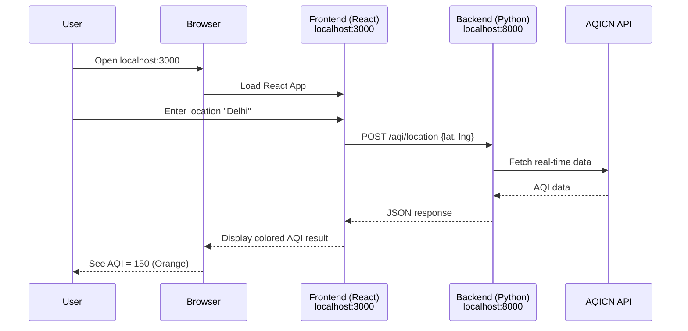

# 🚀 Local Setup & Running the Application

This guide walks you through setting up and running the AQI Calculator on your local machine.

---

## 📋 Prerequisites

Before starting, make sure you have:

| Requirement | Version | Check Command | Installation |
|-------------|---------|---------------|--------------|
| **Python** | 3.9+ | `python --version` | [python.org](https://python.org) |
| **Node.js** | 18+ | `node --version` | [nodejs.org](https://nodejs.org) |
| **npm** | 8+ | `npm --version` | Comes with Node.js |

### API Keys (Required)

You'll need one API key (the other is optional):

| API | Required? | Purpose | Get It From |
|-----|-----------|---------|-------------|
| **AQICN** | ✅ Yes | Air quality data | [aqicn.org/data-platform/token](https://aqicn.org/data-platform/token/) |
| **Google Maps** | ⚪ Optional | Location autocomplete | [Google Cloud Console](https://console.cloud.google.com/) |

> 💡 **Without Google Maps API**: Users can still enter locations manually or use GPS.

---

## 🏃 Quick Start (One Command)

The easiest way to run everything:

```bash
# Windows
.\start.bat

# Linux/Mac
chmod +x start.sh && ./start.sh
```

This automatically:
1. Creates a Python virtual environment
2. Installs all dependencies (Python + Node.js)
3. Starts both backend and frontend servers

**Access the app:**
- 🌐 **Web App**: http://localhost:3000
- 📚 **API Docs**: http://localhost:8000/docs

---

## 🔧 Manual Setup (Step-by-Step)

If you prefer manual control, follow these steps:

### Step 1: Clone & Navigate

```bash
cd aqi_app
```

### Step 2: Backend Setup

```bash
# Navigate to backend
cd backend

# Create Python virtual environment
python -m venv .venv

# Activate virtual environment
# Windows:
.venv\Scripts\activate
# Linux/Mac:
source .venv/bin/activate

# Install Python dependencies
pip install -r requirements.txt

# Create environment file
# Copy .env.example to .env (or create new)
echo "AQICN_API_TOKEN=your_token_here" > .env
```

### Step 3: Frontend Setup

```bash
# Open new terminal, navigate to frontend
cd frontend

# Install Node.js dependencies
npm install

# (Optional) Create .env for Google Maps
echo "VITE_GOOGLE_MAPS_API_KEY=your_key_here" > .env
```

### Step 4: Run Both Servers

You need **two terminal windows**:

**Terminal 1 - Backend:**
```bash
cd backend
.venv\Scripts\activate    # or: source .venv/bin/activate
python main.py
```
✅ Backend runs at http://localhost:8000

**Terminal 2 - Frontend:**
```bash
cd frontend
npm run dev
```
✅ Frontend runs at http://localhost:3000

---

## 🔄 Application Flow

Once running, here's what happens:



---

## 🛠️ Troubleshooting

### Port Already in Use

```bash
# Find what's using port 8000 (backend)
# Windows:
netstat -ano | findstr :8000
taskkill /PID <PID> /F

# Linux/Mac:
lsof -i :8000
kill -9 <PID>
```

### Backend Not Connecting

1. Check backend is running: http://localhost:8000/health
2. Verify `.env` has valid `AQICN_API_TOKEN`
3. Check terminal for error messages

### Frontend Not Loading

1. Ensure `npm install` completed successfully
2. Check that backend is running (frontend needs it)
3. Try clearing cache: `npm run dev -- --force`

### CORS Errors in Browser

The backend already has CORS configured. If you still see errors:
1. Make sure you're accessing http://localhost:3000 (not 127.0.0.1)
2. Restart both servers

---

## 📁 Environment Files Reference

### Backend (`backend/.env`)

```env
# Required - Get from https://aqicn.org/data-platform/token/
AQICN_API_TOKEN=your_aqicn_token_here
```

### Frontend (`frontend/.env`)

```env
# Backend URL (default works for local development)
VITE_API_URL=http://localhost:8000

# Optional - For location autocomplete
VITE_GOOGLE_MAPS_API_KEY=your_google_maps_key_here
```

---

## ✅ Verification Checklist

After setup, verify everything works:

- [ ] Backend health check returns `{"status": "healthy"}` at http://localhost:8000/health
- [ ] API docs load at http://localhost:8000/docs
- [ ] Frontend loads at http://localhost:3000
- [ ] Can search for a location and see AQI results

---

## 🎉 Success!

You're all set! Open http://localhost:3000 and start checking air quality around the world.

**Next Steps:**
- Read [backend/README.md](backend/README.md) to understand the Python code
- Read [frontend/README.md](frontend/README.md) to understand the React code
