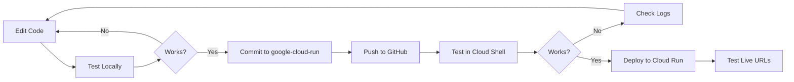

# 🔄 Local vs Cloud Deployment - Key Differences & Workflow

## 📊 Overview: What Changed from Initial Commit

### Initial Commit (afadf82)
- Basic React frontend (Vite dev server)
- Basic FastAPI backend (uvicorn)
- Hardcoded URLs: `http://localhost:8000`
- No containerization
- No cloud configuration

### Current State (google-cloud-run branch)
- **Dockerized** frontend and backend
- **Environment-aware** configuration
- Cloud Run deployment scripts
- Production-ready nginx server for frontend
- Flexible port binding for backend

---

## 🔑 Critical Changes That Enable Cloud Deployment

### 1. **Backend: Dynamic Port Binding** (`backend/main.py`)

**Before:**
```python
if __name__ == "__main__":
    uvicorn.run(app, host="0.0.0.0", port=8000)
```

**After:**
```python
if __name__ == "__main__":
    port = int(os.environ.get("PORT", 8000))
    uvicorn.run(app, host="0.0.0.0", port=port)
```

**Why:** Cloud Run assigns a random port via `PORT` environment variable (typically 8080). Falls back to 8000 locally.

**Impact on Workflow:**
- ✅ **Safe to edit:** This change works both locally and in cloud
- ⚠️ **Don't remove:** Never hardcode port=8000 again
- ✅ **Test locally:** Works fine on localhost:8000 (default)

---

### 2. **Frontend: Environment-Aware API URL** (`frontend/src/App.jsx`)

**Before:**
```javascript
const response = await fetch('http://localhost:8000/calculate-aqi', {
```

**After:**
```javascript
const API_URL = import.meta.env.VITE_API_URL || 'http://localhost:8000'
const response = await fetch(`${API_URL}/calculate-aqi`, {
```

**Why:** Frontend needs to call different backend URLs:
- Local: `http://localhost:8000`
- Cloud: `https://aqi-backend-xxx.run.app`

**Impact on Workflow:**
- ✅ **Safe to edit:** Always use `${API_URL}` for backend calls
- ⚠️ **Don't hardcode:** Never use `localhost:8000` directly in fetch
- ✅ **Test locally:** Works with default fallback
- ✅ **Add new endpoints:** Use `${API_URL}/your-new-endpoint`

---

### 3. **Dockerfiles: Production Containers**

#### Backend Dockerfile
```dockerfile
# Uses PORT environment variable
CMD ["sh", "-c", "uvicorn main:app --host 0.0.0.0 --port ${PORT:-8080}"]
```

**Impact:**
- ✅ **Edit Python code freely:** Just rebuild/redeploy
- ⚠️ **Add new dependencies:** Must update `requirements.txt`
- ⚠️ **Don't change:** CMD line (unless you know Docker well)

#### Frontend Dockerfile
```dockerfile
# Two-stage build: npm build → nginx serve
# Uses ARG for build-time API URL injection
ARG VITE_API_URL
ENV VITE_API_URL=$VITE_API_URL
```

**Impact:**
- ✅ **Edit React code freely:** Just rebuild/redeploy
- ⚠️ **Add new npm packages:** Must update `package.json`
- ⚠️ **Don't change:** Multi-stage build or nginx config (unless you know Docker)

---

### 4. **Cloud Build Configuration** (`cloudbuild.yaml`)

Orchestrates the entire deployment:
1. Builds backend Docker image
2. Pushes to Google Container Registry
3. Deploys backend to Cloud Run
4. Gets backend URL
5. Builds frontend with backend URL
6. Deploys frontend to Cloud Run

**Impact:**
- ✅ **Usually don't touch:** Works automatically
- ⚠️ **Change region:** Edit `_REGION: us-central1` if needed
- ⚠️ **Change service names:** Edit `_BACKEND_SERVICE` / `_FRONTEND_SERVICE`

---

## 🚦 Your Ideal Workflow (google-cloud-run branch)

### Development Flow



### Step-by-Step Commands

#### **1. Make Changes Locally**
```bash
# Edit your code in VS Code
# Example: Update frontend/src/components/AQIForm.jsx
```

#### **2. Test Locally** (IMPORTANT!)
```bash
# On Windows
.\start.bat

# On Linux/Mac
./start.sh
```

**Test at:**
- Frontend: http://localhost:3000
- Backend: http://localhost:8000/docs

#### **3. Commit and Push**
```bash
git add .
git commit -m "feat: Add new feature"
git push origin google-cloud-run
```

#### **4. Test in Cloud Shell** (Optional but Recommended)
```bash
# In Cloud Shell
cd ~/aqi_app
git pull origin google-cloud-run

# Test with local Docker if you want
docker build -t test-backend ./backend
docker run -p 8080:8080 -e PORT=8080 test-backend
```

#### **5. Deploy to Cloud Run**
```bash
# In Cloud Shell
./deploy.sh
```

**Wait 5-10 minutes, then test live URLs!**

---

## ⚠️ What Changes Impact Cloud Deployment

### ✅ **Safe to Change Anytime** (No Cloud Impact)

| What | Examples | Why Safe |
|------|----------|----------|
| **UI Components** | `AQIForm.jsx`, `AQIResult.jsx` | Pure React code |
| **Styling** | `index.css`, Tailwind classes | CSS only |
| **Backend Logic** | `aqi_calculator.py` | Python business logic |
| **API Endpoints** | Add new routes in `main.py` | Just redeploy |
| **Local Scripts** | `start.bat`, `start.sh` | Only for local dev |

**Workflow:** Edit → Test locally → Push → Deploy

---

### ⚠️ **Change with Care** (Requires Rebuild)

| What | File | Why Care Needed | Workflow |
|------|------|-----------------|----------|
| **Python Packages** | `requirements.txt` | Docker rebuild needed | Add package → Test locally → Deploy (rebuilds image) |
| **NPM Packages** | `package.json` | Docker rebuild needed | `npm install` → Test locally → Deploy |
| **Environment Variables** | `.env.production` | Built into image | Must redeploy frontend |
| **Port Configuration** | `main.py`, Dockerfile | Cloud Run expects specific setup | Test locally first! |

**Workflow:** Edit → Test locally → Push → Deploy (automatic rebuild)

---

### 🚨 **Expert Only** (Can Break Cloud)

| What | File | Why Dangerous | When to Change |
|------|------|---------------|----------------|
| **Docker CMD** | `Dockerfile` | Wrong port = app won't start | Never, unless you understand Cloud Run |
| **Nginx Config** | `nginx.conf` | Wrong port = 502 errors | Only if adding routes/headers |
| **Cloud Build** | `cloudbuild.yaml` | Wrong config = deployment fails | Only if changing regions/names |
| **Entrypoint** | `docker-entrypoint.sh` | Wrong script = container crash | Never, unless you know what you're doing |

**Workflow:** Research → Test in Docker locally → Test in Cloud Shell → Deploy

---

## 🎯 Practical Examples: Common Changes

### Example 1: Add a New API Endpoint

**File:** `backend/main.py`

```python
@app.get("/health")
async def health_check():
    return {"status": "healthy"}
```

**Impact:** ✅ Safe
**Workflow:**
1. Edit `main.py`
2. Test: `http://localhost:8000/docs`
3. Commit & push
4. Deploy: `./deploy.sh`

---

### Example 2: Add a New Python Package

**File:** `backend/requirements.txt`

```txt
fastapi==0.104.1
uvicorn==0.24.0
pydantic==2.5.0
redis==5.0.0  # NEW
```

**Impact:** ⚠️ Requires Docker rebuild
**Workflow:**
1. Add to `requirements.txt`
2. Test locally: `pip install redis`
3. Update code to use redis
4. Commit & push
5. Deploy: `./deploy.sh` (auto-rebuilds with redis)

---

### Example 3: Change API URL Structure

**Scenario:** You want to change endpoint from `/calculate-aqi` to `/api/v1/aqi`

**Files to Change:**
1. `backend/main.py` - update route decorator
2. `frontend/src/App.jsx` - update fetch URL

```javascript
// App.jsx
const response = await fetch(`${API_URL}/api/v1/aqi`, {  // Changed
```

**Impact:** ✅ Safe (both files change together)
**Workflow:**
1. Change backend route
2. Change frontend fetch
3. Test locally
4. Commit both changes
5. Push & deploy

---

### Example 4: Add Environment Variable

**Scenario:** Add a feature flag

**Files:**
1. `backend/main.py`:
```python
FEATURE_ENABLED = os.environ.get("FEATURE_FLAG", "false") == "true"
```

2. `cloudbuild.yaml` (for Cloud Run deployment):
```yaml
# In deploy-backend step, add:
- '--set-env-vars'
- 'FEATURE_FLAG=true'
```

**Impact:** ⚠️ Deployment config change
**Workflow:**
1. Code change with default
2. Test locally (defaults work)
3. Update `cloudbuild.yaml`
4. Deploy

---

## 📋 Quick Reference: Key Files

### Files You'll Edit Often
- ✅ `frontend/src/**/*.jsx` - React components
- ✅ `frontend/src/index.css` - Styles
- ✅ `backend/main.py` - API routes
- ✅ `backend/aqi_calculator.py` - Business logic

### Files You'll Edit Sometimes
- ⚠️ `backend/requirements.txt` - Add Python packages
- ⚠️ `frontend/package.json` - Add npm packages
- ⚠️ `frontend/src/App.jsx` - API URL calls

### Files You Should Rarely Touch
- 🚨 `backend/Dockerfile`
- 🚨 `frontend/Dockerfile`
- 🚨 `frontend/nginx.conf`
- 🚨 `cloudbuild.yaml`
- 🚨 `frontend/docker-entrypoint.sh`

### Files That Don't Affect Cloud
- ✅ `start.sh` / `start.bat` - Local only
- ✅ `SETUP.md` / `README.md` - Documentation
- ✅ `.gitignore` - Git config

---

## 🐛 Common Issues & Solutions

### Issue 1: "Local works, Cloud doesn't"

**Symptom:** App works at `localhost:3000`, but Cloud Run shows errors

**Likely Causes:**
1. **Frontend can't reach backend**
   - Check: Backend URL in cloud environment
   - Fix: Verify `cloudbuild.yaml` sets `VITE_API_URL` correctly

2. **Port mismatch**
   - Check: Backend using `os.environ.get("PORT")`
   - Fix: Don't hardcode port=8000

3. **CORS issues**
   - Check: Backend logs for CORS errors
   - Fix: Ensure CORS middleware in `main.py`

**Debug:**
```bash
# Check Cloud Run logs
gcloud run logs tail aqi-backend --region=us-central1
gcloud run logs tail aqi-frontend --region=us-central1
```

---

### Issue 2: "Forgot to Update requirements.txt"

**Symptom:** Local works, Cloud crashes with "ModuleNotFoundError"

**Fix:**
```bash
# Generate from current environment
pip freeze > backend/requirements.txt

# Or add manually
echo "your-package==1.0.0" >> backend/requirements.txt
```

---

### Issue 3: "Changed API endpoint, frontend gets 404"

**Symptom:** Backend works at `/new-endpoint`, frontend still calls `/old-endpoint`

**Fix:** Update BOTH places:
1. `backend/main.py` - route decorator
2. `frontend/src/App.jsx` - fetch URL

**Test:** Check Network tab in browser DevTools

---

### Issue 4: "Deploy takes forever"

**Causes:**
- **First deploy:** ~10 minutes (normal)
- **No changes:** ~2 minutes (rebuilds cache)
- **Package changes:** ~5-8 minutes (reinstalls)

**Speed up:**
- Don't change Dockerfiles unnecessarily
- Use specific package versions (faster caching)
- Only deploy when ready (not for every small change)

---

## 🎓 Understanding the Dual Environment

### Local Environment
```
Your Computer
├── Python venv (.venv/)
├── Node modules (frontend/node_modules/)
├── Vite dev server (Port 3000)
├── Uvicorn dev server (Port 8000)
└── Environment: Development

Uses:
- start.bat / start.sh
- Auto-reload on code changes
- Default environment variables
```

### Cloud Environment
```
Google Cloud Run
├── Backend Container (Port from $PORT env)
├── Frontend Container (nginx on Port from $PORT env)
├── Built production code (no source)
├── Separate services with unique URLs
└── Environment: Production

Uses:
- Dockerfiles
- cloudbuild.yaml
- Environment variables set in deploy
- No auto-reload (must redeploy)
```

### Key Differences

| Aspect | Local | Cloud |
|--------|-------|-------|
| **Backend URL** | `localhost:8000` | `https://aqi-backend-xxx.run.app` |
| **Frontend URL** | `localhost:3000` | `https://aqi-frontend-xxx.run.app` |
| **Server** | Uvicorn (dev) + Vite (dev) | Uvicorn (prod) + nginx |
| **Code changes** | Auto-reload | Must redeploy |
| **Port** | Fixed (3000, 8000) | Dynamic ($PORT) |
| **Environment** | .env file / defaults | Cloud Run env vars |
| **Dependencies** | venv + node_modules | Docker image layers |

---

## ✅ Best Practices for Your Workflow

### 1. **Always Test Locally First**
Never push untested code. Use `start.bat` / `start.sh` every time.

### 2. **Keep google-cloud-run Branch Clean**
Only merge working features. Keep master for "pure" version if needed.

### 3. **Commit Messages Matter**
```bash
# Good
git commit -m "feat: Add PM2.5 threshold warning"
git commit -m "fix: Correct O3 AQI calculation"

# Bad
git commit -m "changes"
git commit -m "stuff"
```

### 4. **Update Dependencies Carefully**
```bash
# Test new package locally first
pip install new-package
# Works? Add to requirements.txt
echo "new-package==1.0.0" >> backend/requirements.txt
```

### 5. **Monitor Cloud Logs**
```bash
# After each deployment, check logs
gcloud run logs tail aqi-backend --region=us-central1
```

### 6. **Use Feature Flags for Risky Changes**
```python
# Backend
EXPERIMENTAL_FEATURE = os.environ.get("EXPERIMENTAL", "false") == "true"

if EXPERIMENTAL_FEATURE:
    # New code
else:
    # Old code
```

Deploy without flag → Test → Enable flag in Cloud Run → Test → Remove old code

---

## 🔄 Complete Workflow Checklist

### Before Starting Work
- [ ] `git checkout google-cloud-run`
- [ ] `git pull origin google-cloud-run`
- [ ] `.\start.bat` - verify local works

### During Development
- [ ] Make changes
- [ ] Test in browser (localhost:3000)
- [ ] Check console for errors
- [ ] Test API endpoints (localhost:8000/docs)

### Before Committing
- [ ] All features work locally
- [ ] No console errors
- [ ] Code is clean (no commented-out blocks)
- [ ] New dependencies added to requirements.txt / package.json

### Deployment
- [ ] `git add .`
- [ ] `git commit -m "meaningful message"`
- [ ] `git push origin google-cloud-run`
- [ ] Open Cloud Shell
- [ ] `cd ~/aqi_app && git pull origin google-cloud-run`
- [ ] `./deploy.sh`
- [ ] Wait 5-10 minutes
- [ ] Test live URLs
- [ ] Check logs if errors

### After Deployment
- [ ] Frontend URL works
- [ ] Backend URL/docs works
- [ ] Calculatorworks end-to-end
- [ ] No errors in Cloud logs

---

## 📚 Summary

**What You Need to Remember:**

1. **Two critical changes enable cloud deployment:**
   - Backend: Dynamic port via `PORT` environment variable
   - Frontend: Dynamic API URL via `VITE_API_URL`

2. **Your workflow is simple:**
   - Change code → Test locally → Push to GitHub → Deploy to Cloud

3. **Most changes are safe:**
   - React components, Python logic, new endpoints = just redeploy

4. **Some changes need care:**
   - New packages, environment variables = update configs

5. **Rare changes are dangerous:**
   - Dockerfiles, nginx, cloudbuild = ask for help first!

6. **Always test locally before deploying:**
   - `start.bat` is your friend

**The google-cloud-run branch is now your main development branch. Master is legacy.**

Happy deploying! 🚀
