```mermaid
flowchart TD
    A["Input: {pm25: 25, pm10: 80, o3: 0.06}"] --> B["Calculate each"]
    B --> C["PM2.5 → AQI 78"]
    B --> D["PM10 → AQI 65"]
    B --> E["O3 → AQI 52"]
    C & D & E --> F["Find maximum: 78"]
    F --> G["Dominant: PM2.5"]
    G --> H["Category: Moderate"]
    H --> I["Return result"]
```

# 🐍 Python Developer Guide

This guide explains **every Python file** in the project line by line. If you know Python, you'll understand everything here!

---

## 📋 Table of Contents

1. [Project Overview](#-project-overview)
2. [Understanding main.py](#-understanding-mainpy---the-api-server)
3. [Understanding aqi_calculator.py](#-understanding-aqi_calculatorpy---the-brain)
4. [How Frontend Talks to Backend](#-how-frontend-talks-to-backend)
5. [Making Changes](#-making-changes)

---

## 🗺️ Project Overview


**Two files, two jobs:**
| File | Job | Analogy |
|------|-----|---------|
| `main.py` | Receives web requests, sends responses | Receptionist |
| `aqi_calculator.py` | Does the actual math | Calculator |

---

## 📄 Understanding `main.py` - The API Server

Let's go through the entire file section by section:

### Section 1: Imports

```python
from fastapi import FastAPI, HTTPException
from fastapi.middleware.cors import CORSMiddleware
from pydantic import BaseModel
from typing import Optional
from datetime import datetime
import uvicorn
from aqi_calculator import calculate_aqi, generate_sample_pollutant_data
```

**What each import does:**


| Import | Python Equivalent | What It Does |
|--------|------------------|--------------|
| `FastAPI` | `Flask` | Creates the web application |
| `HTTPException` | `raise Exception` | Returns error to user |
| `CORSMiddleware` | No equivalent | Lets browser talk to server |
| `BaseModel` | `@dataclass` | Validates incoming data |
| `uvicorn` | `flask run` | Runs the server |

### Section 2: Create the App

```python
app = FastAPI(title="AQI Calculator API")
```

This is like:
```python
# Flask equivalent
from flask import Flask
app = Flask(__name__)
```

### Section 3: CORS Configuration

```python
app.add_middleware(
    CORSMiddleware,
    allow_origins=["*"],      # Who can connect (everyone)
    allow_credentials=True,
    allow_methods=["*"],      # What methods (GET, POST, etc.)
    allow_headers=["*"],      # What headers
)
```



```mermaid
flowchart LR
    A[Browser at localhost:3000] -->|"Without CORS"| B[❌ Blocked!]
    A -->|"With CORS"| C[✅ Allowed!]
    C --> D[Backend at localhost:8000]
```

**Why do we need this?**
- Browsers block requests between different ports (3000 → 8000)
- CORS says "it's okay, let them through"
- Without this, your frontend can't talk to your backend!

### Section 4: Data Models (Pydantic)

```python
class AQIRequest(BaseModel):
    location: str
    date: str
    pm25: Optional[float] = None
    pm10: Optional[float] = None
    co: Optional[float] = None
    no2: Optional[float] = None
    so2: Optional[float] = None
    o3: Optional[float] = None
```

This is like a `dataclass` with superpowers:

```python
# Python dataclass (similar concept)
from dataclasses import dataclass

@dataclass
class AQIRequest:
    location: str
    date: str
    pm25: float = None
```

**But Pydantic does MORE:**

```mermaid
flowchart TD
    A[User sends: location=123] --> B{Pydantic Validates}
    B -->|"location must be string"| C[❌ Error: validation failed]
    
    D[User sends: location='NYC'] --> E{Pydantic Validates}
    E -->|"All good!"| F[✅ Request accepted]
```


### Section 5: API Endpoints

#### Endpoint 1: Root `/`
```python
@app.get("/")
async def root():
    return {"message": "AQI Calculator API", "status": "running"}
```

- `@app.get("/")` = When someone visits http://localhost:8000/
- `async def` = Like `def` but can handle many requests at once
- Returns a dictionary → becomes JSON automatically

#### Endpoint 2: Health Check `/health`
```python
@app.get("/health")
async def health_check():
    return {"status": "healthy"}
```

**Why have this?**
- Deployment platforms check if your app is alive
- Like a heartbeat monitor 💓

#### Endpoint 3: Calculate AQI `/calculate-aqi`

```python
@app.post("/calculate-aqi", response_model=AQIResponse)
async def calculate_aqi_endpoint(request: AQIRequest):
```


**The full function explained:**

```python
@app.post("/calculate-aqi", response_model=AQIResponse)
async def calculate_aqi_endpoint(request: AQIRequest):
    try:
        # Step 1: Validate the date
        try:
            date_obj = datetime.fromisoformat(request.date.replace('Z', '+00:00'))
        except ValueError:
            raise HTTPException(status_code=400, detail="Invalid date format")
        
        # Step 2: Collect pollutant data from request
        pollutants = {}
        if request.pm25 is not None:
            pollutants['pm25'] = request.pm25
        # ... same for other pollutants
        
        # Step 3: If no pollutants given, make up some data
        if not pollutants:
            pollutants = generate_sample_pollutant_data()
        
        # Step 4: Calculate AQI
        result = calculate_aqi(pollutants)
        
        # Step 5: Return the response
        return AQIResponse(
            aqi=result['aqi'],
            category=result['category'],
            color=result['color'],
            location=request.location,
            date=request.date,
            dominant_pollutant=result['dominant_pollutant'],
            message=result['message']
        )
    
    except HTTPException:
        raise  # Re-raise HTTP errors as-is
    except Exception as e:
        raise HTTPException(status_code=500, detail=f"Error: {str(e)}")
```

### Section 6: Run the Server

```python
if __name__ == "__main__":
    uvicorn.run(app, host="0.0.0.0", port=8000)
```

This is like:
```python
# Flask equivalent
if __name__ == "__main__":
    app.run(host="0.0.0.0", port=8000)
```

---

## 🧮 Understanding `aqi_calculator.py` - The Brain

This is where the actual AQI calculation happens. Pure Python math!

### The EPA Breakpoint Tables

```python
PM25_BREAKPOINTS = [
    (0.0, 12.0, 0, 50),      # Good
    (12.1, 35.4, 51, 100),   # Moderate
    (35.5, 55.4, 101, 150),  # Unhealthy for Sensitive
    (55.5, 150.4, 151, 200), # Unhealthy
    (150.5, 250.4, 201, 300),# Very Unhealthy
    (250.5, 500.4, 301, 500),# Hazardous
]
```

Each tuple means: `(C_low, C_high, I_low, I_high)`
- `C` = Concentration (pollution level)
- `I` = Index (AQI value)

```mermaid
flowchart LR
    A["PM2.5 = 25 µg/m³"] --> B{Find range}
    B --> C["12.1 - 35.4 → 51-100"]
    C --> D["AQI = 69 (Moderate)"]
```



### The AQI Formula

```python
def calculate_aqi_for_pollutant(concentration: float, breakpoints: list) -> int:
    for c_low, c_high, i_low, i_high in breakpoints:
        if c_low <= concentration <= c_high:
            # EPA AQI formula
            aqi = ((i_high - i_low) / (c_high - c_low)) * (concentration - c_low) + i_low
            return round(aqi)
    return 500  # If off the charts
```

**Visual explanation:**

```mermaid
flowchart TD
    A["Input: PM2.5 = 25"] --> B["Find breakpoint range"]
    B --> C["Range: 12.1-35.4 → 51-100"]
    C --> D["Apply formula"]
    D --> E["AQI = ((100-51)/(35.4-12.1)) × (25-12.1) + 51"]
    E --> F["AQI = 2.1 × 12.9 + 51"]
    F --> G["AQI = 27.1 + 51 = 78"]
    G --> H["Return: 78 (Moderate)"]
```



### Getting the Category

```python
def get_aqi_category(aqi: int) -> Tuple[str, str]:
    if aqi <= 50:
        return "Good", "#00e400"           # Green
    elif aqi <= 100:
        return "Moderate", "#ffff00"       # Yellow
    elif aqi <= 150:
        return "Unhealthy for Sensitive Groups", "#ff7e00"  # Orange
    elif aqi <= 200:
        return "Unhealthy", "#ff0000"      # Red
    elif aqi <= 300:
        return "Very Unhealthy", "#8f3f97" # Purple
    else:
        return "Hazardous", "#7e0023"      # Maroon
```

### The Main Calculate Function

```python
def calculate_aqi(pollutants: Dict[str, float]) -> Dict:
    aqi_values = {}
    
    # Calculate AQI for each pollutant
    for pollutant, concentration in pollutants.items():
        if concentration is not None:
            breakpoints = POLLUTANT_BREAKPOINTS[pollutant]
            aqi_value = calculate_aqi_for_pollutant(concentration, breakpoints)
            aqi_values[pollutant] = aqi_value
    
    # Overall AQI = highest individual AQI
    max_aqi = max(aqi_values.values())
    dominant_pollutant = max(aqi_values, key=aqi_values.get)
    
    category, color = get_aqi_category(max_aqi)
    message = get_health_message(max_aqi)
    
    return {
        'aqi': max_aqi,
        'category': category,
        'color': color,
        'dominant_pollutant': dominant_pollutant,
        'message': message,
    }
```



---

## 🔌 How Frontend Talks to Backend

The frontend uses JavaScript's `fetch()`, which is like Python's `requests`:


**JavaScript `fetch()` vs Python `requests`:**

```javascript
// JavaScript (frontend)
const response = await fetch('http://localhost:8000/calculate-aqi', {
    method: 'POST',
    headers: {'Content-Type': 'application/json'},
    body: JSON.stringify({location: 'NYC', date: '2026-01-06'})
});
const data = await response.json();
```

```python
# Python equivalent (if you were to call the API)
import requests

response = requests.post('http://localhost:8000/calculate-aqi', 
    json={'location': 'NYC', 'date': '2026-01-06'}
)
data = response.json()
```

**They're almost identical!**

---

## ✏️ Making Changes

### Want to add a new pollutant?

1. Add breakpoints in `aqi_calculator.py`:
```python
NEW_POLLUTANT_BREAKPOINTS = [
    (0, 10, 0, 50),
    (11, 20, 51, 100),
    # ... etc
]

POLLUTANT_BREAKPOINTS['new_pollutant'] = NEW_POLLUTANT_BREAKPOINTS
```

2. Add field in `main.py`:
```python
class AQIRequest(BaseModel):
    # ... existing fields
    new_pollutant: Optional[float] = None
```

3. Handle it in the endpoint:
```python
if request.new_pollutant is not None:
    pollutants['new_pollutant'] = request.new_pollutant
```

### Want to add a new endpoint?

```python
@app.get("/cities")
async def get_cities():
    return {"cities": ["New York", "Los Angeles", "Chicago"]}
```

### Want to connect to a real AQI API?

```python
import httpx  # async version of requests

async def get_real_aqi(city: str):
    async with httpx.AsyncClient() as client:
        response = await client.get(
            f"https://api.openweathermap.org/data/2.5/air_pollution",
            params={"q": city, "appid": "YOUR_API_KEY"}
        )
        return response.json()
```

---

## 🧪 Testing Your Changes

### Test with the automatic docs:
1. Go to http://localhost:8000/docs
2. Click on an endpoint
3. Click "Try it out"
4. Enter test data
5. Click "Execute"

### Test with Python:
```python
import requests

# Test the API
response = requests.post(
    'http://localhost:8000/calculate-aqi',
    json={'location': 'Test City', 'date': '2026-01-06'}
)
print(response.json())
```

### Test with curl (command line):
```bash
curl -X POST http://localhost:8000/calculate-aqi \
  -H "Content-Type: application/json" \
  -d '{"location": "NYC", "date": "2026-01-06"}'
```

---

## 🎓 Summary


**Key takeaways:**
- ✅ FastAPI is like Flask but faster and with auto-docs
- ✅ Pydantic validates data automatically (like dataclasses++)
- ✅ The AQI formula is simple math with lookup tables
- ✅ `fetch()` in JavaScript ≈ `requests` in Python

**You can now:**
- Read and understand all the Python code
- Make changes to the backend
- Add new endpoints
- Test your changes

**Next:** Read [DEPLOYMENT.md](DEPLOYMENT.md) to learn how to put this online! 🚀
