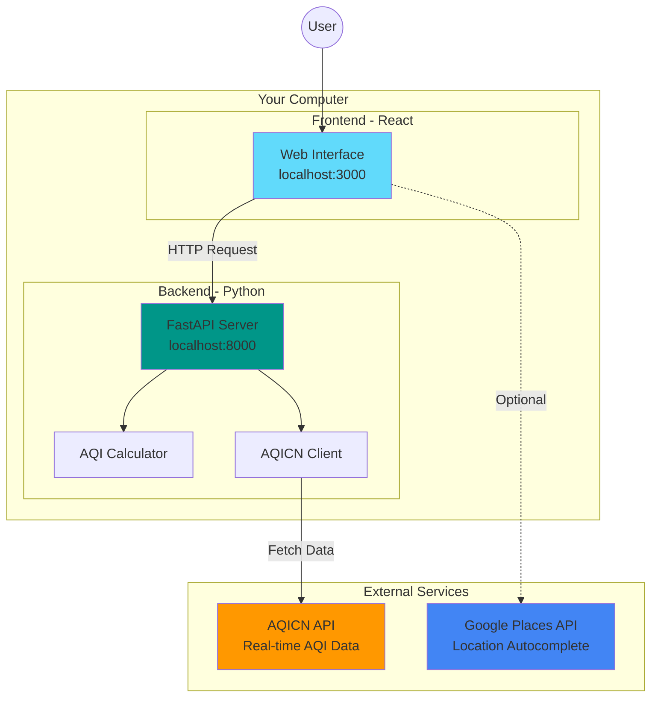
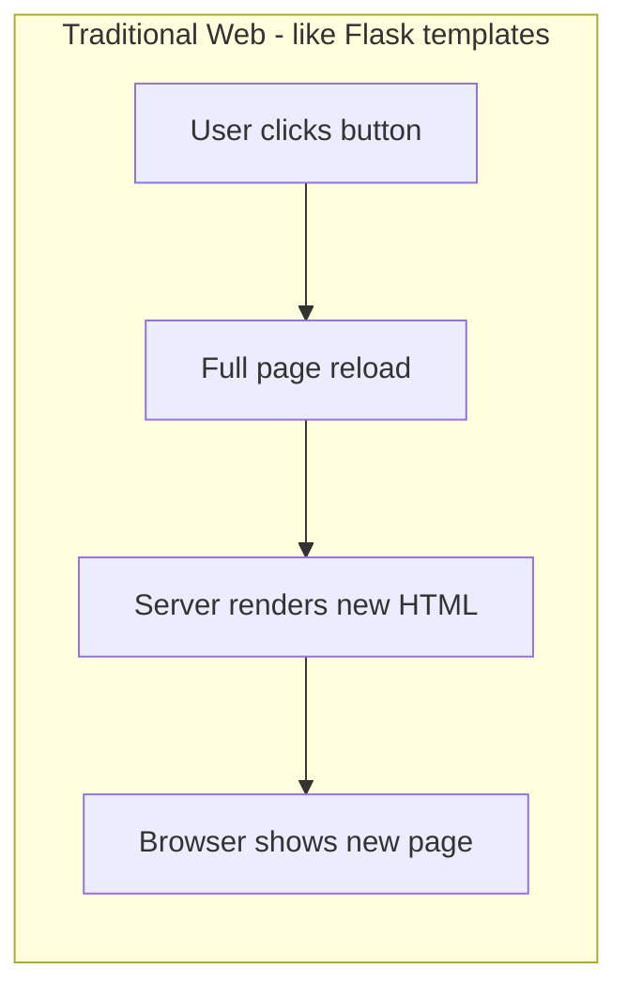
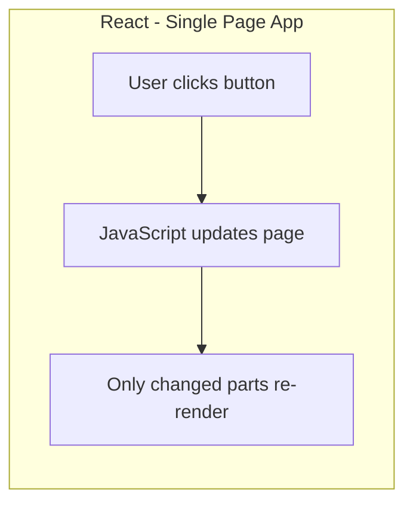
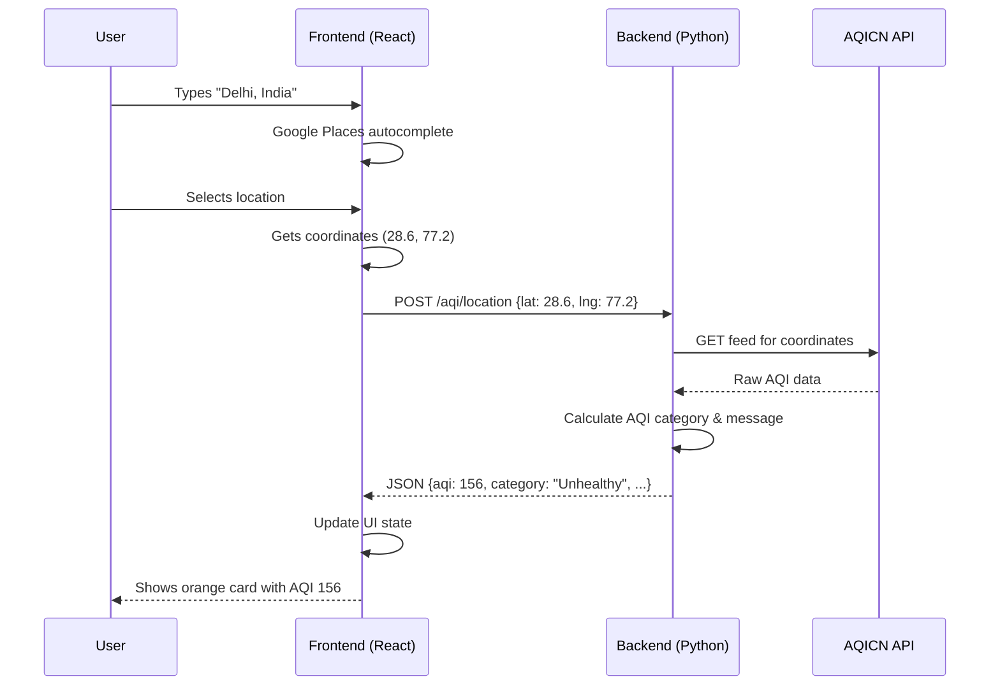

# 🌬️ AQI Calculator

A real-time **Air Quality Index** web application that helps you check air pollution levels anywhere in the world.

> **Built for learning:** This project demonstrates a full-stack web application with a Python backend and React frontend. Perfect for Python developers wanting to understand modern web development!

---

## 🎯 What Does This App Do?

1. **Enter any location** (city, address, or landmark)
2. **Get real-time air quality data** from monitoring stations worldwide
3. **See results visually** with color-coded AQI, health advice, and forecasts

```
✅ Works globally - check air quality in Delhi, Tokyo, New York, anywhere!
✅ Real-time data from World Air Quality Index Project (WAQI)
✅ Health recommendations based on current pollution levels
```

---

## 🏗️ High-Level Architecture



### The Restaurant Analogy 🍽️

Think of this application like a restaurant:

| Component | Restaurant | Our App | Technology |
|-----------|------------|---------|------------|
| **Frontend** | Dining room (what customers see) | Web interface | React |
| **Backend** | Kitchen (where food is prepared) | API server | Python + FastAPI |
| **External API** | Food suppliers | AQICN (air quality data) | HTTP requests |

---

## 📁 Project Structure

```
aqi_app/
├── backend/                 ← Python code (start here!)
│   ├── main.py              ← API server entry point
│   ├── aqi_calculator.py    ← AQI calculation logic
│   ├── aqicn_client.py      ← Fetches data from AQICN
│   ├── requirements.txt     ← Python dependencies
│   └── README.md            ← Backend documentation
│
├── frontend/                ← React code
│   ├── src/
│   │   ├── App.jsx          ← Main app with routing
│   │   ├── pages/           ← Full page components
│   │   └── components/      ← Reusable UI pieces
│   ├── package.json         ← Node.js dependencies
│   └── README.md            ← Frontend documentation
│
├── LOCAL_SETUP.md           ← How to run locally
├── start.bat / start.sh     ← One-click startup scripts
└── README.md                ← This file
```

---

## 🚀 Quick Start

```bash
# Windows
.\start.bat

# Linux/Mac
./start.sh
```

Then open http://localhost:3000

> 📖 For detailed setup instructions, see [LOCAL_SETUP.md](LOCAL_SETUP.md)

---

## ⚛️ React Primer for Python Developers

If you know Python but not React, this section is for you!

### What is React?

React is a JavaScript library for building user interfaces. Think of it as a way to create **interactive HTML** that updates automatically when data changes.





### React Concepts → Python Equivalents

| React Concept | Python Equivalent | Example |
|--------------|-------------------|---------|
| **Component** | Function returning HTML | `def MyButton(): return "<button>Click</button>"` |
| **JSX** | f-strings with HTML | `f"<div>{name}</div>"` |
| **Props** | Function arguments | `def greet(name): ...` |
| **State** | Variables that trigger UI updates | No direct equivalent - closest is a class attribute |
| **`useState()`** | Creating a reactive variable | `count, setCount = useState(0)` |
| **`fetch()`** | `requests.get()` / `requests.post()` | Same concept! |

### Side-by-Side Comparison

**Python (Flask-style thinking):**
```python
# A function that returns HTML
def greeting(name):
    return f"<h1>Hello, {name}!</h1>"

# Using it
greeting("Alice")  # Returns: <h1>Hello, Alice!</h1>
```

**React (same concept!):**
```jsx
// A component that returns HTML (JSX)
function Greeting({ name }) {
    return <h1>Hello, {name}!</h1>
}

// Using it
<Greeting name="Alice" />  // Renders: <h1>Hello, Alice!</h1>
```

### Understanding `useState` - The Key React Concept

In Python, when you change a variable, nothing happens to the display:
```python
count = 0
count = count + 1  # Variable changes, but no UI update
print(count)       # You have to explicitly print
```

In React, `useState` creates a variable that **automatically updates the UI**:
```jsx
const [count, setCount] = useState(0)  // Initial value is 0

// When user clicks button:
setCount(count + 1)  // UI automatically shows new value!
```

### Reading React Code - A Cheat Sheet

```jsx
// 1. Import statements (like Python imports)
import { useState } from 'react'
import AQIResult from './components/AQIResult'

// 2. Component definition (like a Python function)
function Calculator() {
    // 3. State variables (reactive variables)
    const [aqi, setAqi] = useState(null)
    const [loading, setLoading] = useState(false)
    
    // 4. Regular function (same as Python!)
    const handleSubmit = async () => {
        setLoading(true)
        const response = await fetch('/api/aqi')  // Like requests.get()
        const data = await response.json()
        setAqi(data)
        setLoading(false)
    }
    
    // 5. Return JSX (HTML-like syntax)
    return (
        <div>
            <h1>AQI Calculator</h1>
            <button onClick={handleSubmit}>Get AQI</button>
            {loading && <p>Loading...</p>}
            {aqi && <AQIResult data={aqi} />}
        </div>
    )
}

// 6. Export (makes it available to other files)
export default Calculator
```

### The `{}` Curly Braces in JSX

In JSX (React's HTML-like syntax), curly braces `{}` mean "execute this JavaScript":

```jsx
// Similar to Python f-strings!
// Python: f"Hello, {name}"
// React:  <h1>Hello, {name}</h1>

// Conditional rendering:
{loading && <Spinner />}        // If loading is true, show Spinner
{error ? <Error /> : <Result />} // If error, show Error, else Result
```

---

## 📚 Learning Path

1. **Start with the Backend** → [backend/README.md](backend/README.md)
   - You already know Python!
   - FastAPI is similar to Flask
   - Understand how the API works

2. **Then Explore the Frontend** → [frontend/README.md](frontend/README.md)
   - Apply the React concepts above
   - See how components connect
   - Trace data flow from API to UI

3. **Run the App** → [LOCAL_SETUP.md](LOCAL_SETUP.md)
   - Get hands-on experience
   - Modify code and see changes
   - Build your understanding

---

## 🔗 Key Files to Read

| File | Why It's Important | Difficulty |
|------|-------------------|------------|
| `backend/main.py` | API endpoints - you know this! | ⭐ Easy |
| `backend/aqi_calculator.py` | Pure Python logic | ⭐ Easy |
| `frontend/src/App.jsx` | See how React routing works | ⭐⭐ Medium |
| `frontend/src/pages/Calculator.jsx` | Main page with API calls | ⭐⭐ Medium |
| `frontend/src/components/AQIResult.jsx` | UI component example | ⭐⭐ Medium |

---

## 📊 Data Flow

Here's how data moves through the application when you search for a location:



---

## 🤝 Contributing

Found a bug or want to improve something? 

1. Fork the repository
2. Create a feature branch
3. Make your changes
4. Submit a pull request

---

## 📄 License

MIT License - feel free to use this for learning or as a starting point for your own projects!

---

## 🙏 Acknowledgments

- Air quality data from [World Air Quality Index Project](https://waqi.info/)
- Built with [FastAPI](https://fastapi.tiangolo.com/) and [React](https://react.dev/)
