# 🌬️ AQI Calculator (aqitoday.in)

A real-time **Air Quality Index** web application that helps you check air pollution levels anywhere in the world. See the health impact of pollution visualized as cigarette equivalents!

> **Built for learning:** This project demonstrates a full-stack web application with a Python backend and React frontend. Perfect for Python developers wanting to understand modern web development!

---

## 🎯 What Does This App Do?

Think of it as a **weather app, but for air quality**. Here's what happens when you use it:

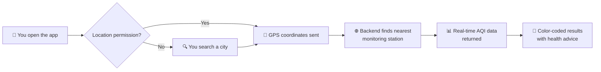

**Key Features:**
| Feature | What it does | Example |
|---------|--------------|---------|
| 🌍 **Global Coverage** | Check air quality anywhere | Delhi, Tokyo, New York, Paris |
| 📍 **Auto-Location** | Automatically detects your GPS | Opens and shows local AQI |
| 🔍 **Search Any Place** | Type any location to check | "HSR Layout, Bangalore" |
| 🚬 **Cigarette Equivalent** | Visualize health impact | "Breathing this = 2.5 cigarettes/day" |
| 💡 **Health Advice** | Personalized recommendations | "Wear N95 mask outdoors" |
| 📅 **3-Day Forecast** | Plan ahead | See if tomorrow will be better |
| ⭐ **Confidence Score** | Data reliability indicator | Based on station distance & data freshness |
| 📊 **Analytics Tracking** | Usage monitoring with Google Analytics | Track visitor behavior and app performance |

---

## 🏗️ How Does It Work? (Architecture Overview)

This diagram shows all the pieces and how they talk to each other:

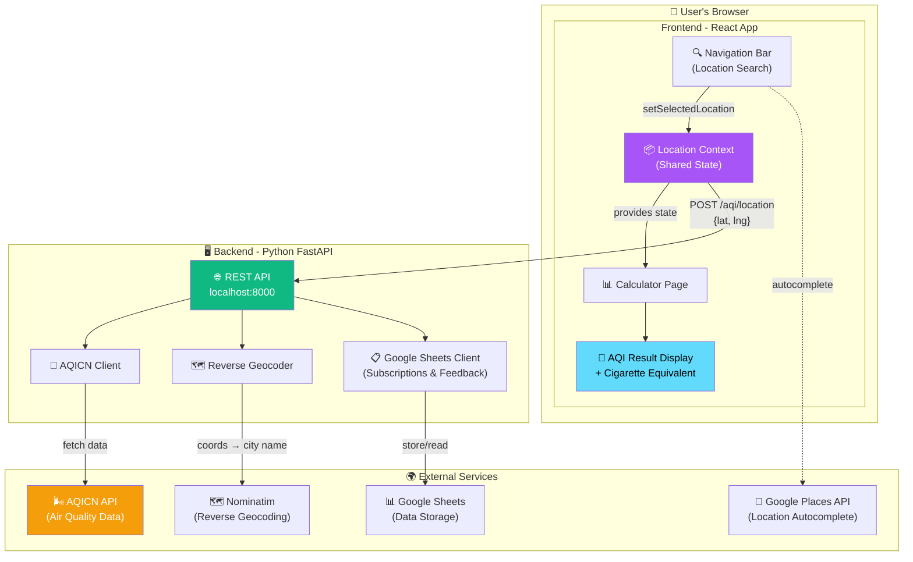

### 🍽️ The Restaurant Analogy

Think of this application like a restaurant:

| Restaurant | Our App | What It Does |
|------------|---------|--------------|
| 🍽️ **Dining Room** | Frontend (React) | What users see and interact with |
| 👨‍🍳 **Kitchen** | Backend (Python) | Where data is prepared and processed |
| 📋 **Order Ticket System** | Location Context | Keeps track of current order (location + AQI data) |
| 🥬 **Food Suppliers** | AQICN API | Provides raw ingredients (air quality data) |
| 📝 **Reservation Book** | Google Sheets | Stores customer info (subscriptions) |

---

## 📁 Project Structure

```
aqi_app/
├── 📄 README.md                ← You are here! Project overview
├── 📄 LOCAL_SETUP.md           ← How to run locally (start here!)
├── 📄 DEPLOYMENT.md            ← Deploy to Google Cloud Run
├── 📄 GOOGLE_SHEETS_SETUP.md   ← Set up subscription storage
├── 🚀 start.bat / start.sh     ← One-click startup scripts
│
├── 🐍 backend/                  ← Python code (FastAPI)
│   ├── main.py                 ← API endpoints (REST API)
│   ├── aqicn_client.py         ← Fetches data from AQICN
│   ├── aqi_calculator.py       ← EPA AQI calculation logic
│   ├── sheets_client.py        ← Google Sheets integration
│   ├── requirements.txt        ← Python dependencies
│   ├── Dockerfile              ← Container config
│   └── README.md               ← Backend documentation
│
└── ⚛️ frontend/                 ← React code
    ├── src/
    │   ├── main.jsx            ← Entry point
    │   ├── App.jsx             ← App shell with routing
    │   ├── index.css           ← Tailwind CSS styles
    │   ├── contexts/
    │   │   └── LocationContext.jsx  ← Shared state (location + AQI)
    │   ├── pages/
    │   │   ├── Calculator.jsx  ← Main AQI calculator page
    │   │   └── Blog.jsx        ← Blog page
    │   └── components/
    │       ├── Navigation.jsx  ← Header with search bar
    │       ├── AQIResult.jsx   ← Results display (850+ lines!)
    │       └── AQIForm.jsx     ← Manual AQI input form
    ├── package.json            ← Node.js dependencies
    ├── Dockerfile              ← Container config
    └── README.md               ← Frontend documentation
```

### 📂 Which File Does What?

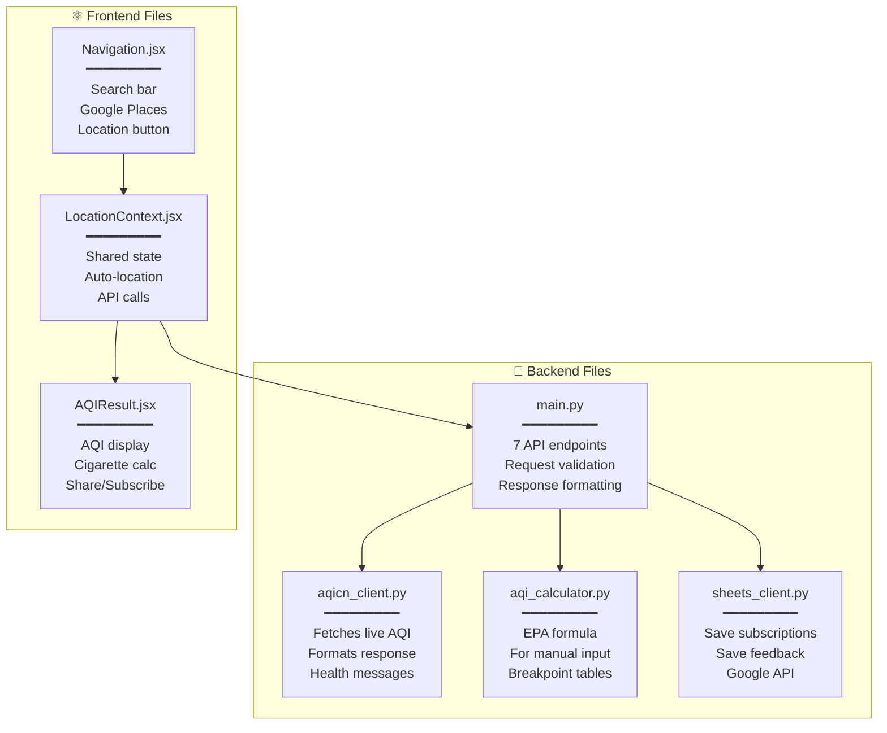

---

## 🚀 Quick Start

```bash
# Windows
.\start.bat

# Linux/Mac
./start.sh
```

Then open http://localhost:3000

> 📖 For detailed setup instructions, see [LOCAL_SETUP.md](LOCAL_SETUP.md)

---

## ✨ Key Features Explained

### 1. 📍 Automatic Location Detection

When you first visit, the app asks for location permission. If granted, it immediately fetches your local AQI!

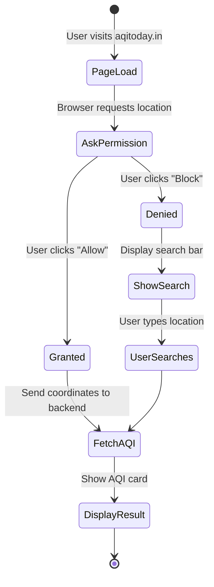

### 2. 🔍 Smart Location Search

The search bar in the header uses Google Places API for autocomplete:

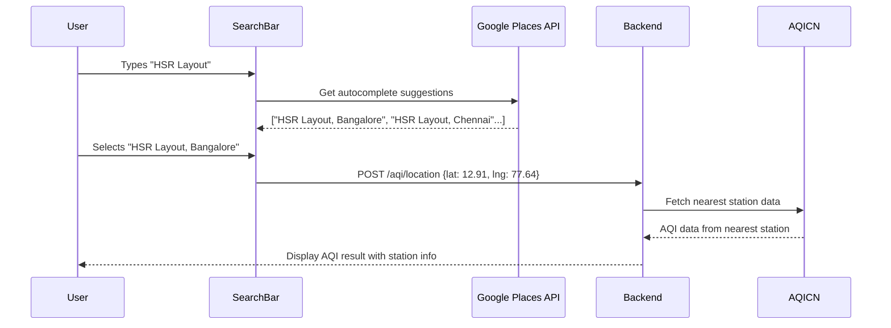

### 3. 🚬 Cigarette Equivalent

Based on Berkeley Earth research, we convert air pollution to cigarettes/day - making health impact tangible:

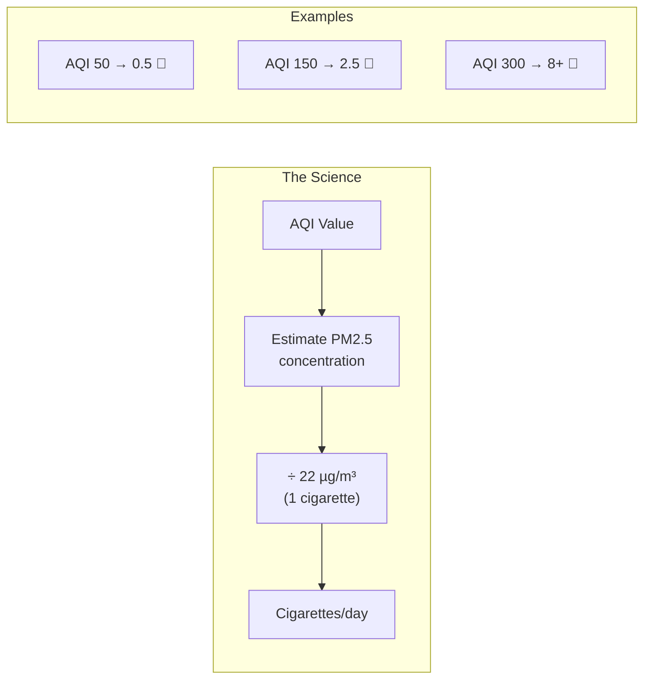

> **Research**: Berkeley Earth found that breathing air with 22 µg/m³ of PM2.5 is equivalent to smoking 1 cigarette per day.

### 4. ⭐ Confidence Score

The app shows how reliable the data is based on two factors:

| Factor | High Confidence | Medium | Low |
|--------|-----------------|--------|-----|
| **Station Distance** | < 5 km | 5-15 km | > 15 km |
| **Data Freshness** | < 1 hour | 1-2 hours | > 2 hours |

### 5. 📊 Complete AQI Dashboard

The result card shows:
- 🎨 **Color-coded AQI** with emoji indicator
- 📍 **Station information** with distance from you
- 🚬 **Cigarette equivalent** with explanation
- 💨 **Dominant pollutant** causing the AQI
- 💡 **Health recommendations** based on AQI level
- 📅 **3-day forecast** (when available)
- 🔬 **Pollutant breakdown** (expandable)

---

## ⚛️ React Primer for Python Developers

If you know Python but not React, this section is for you!

### What is React?

React is a JavaScript library for building user interfaces. Think of it as a way to create **interactive HTML** that updates automatically when data changes.

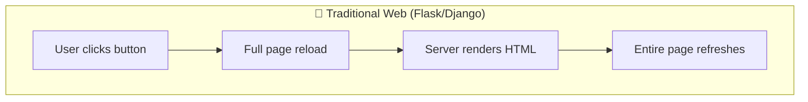

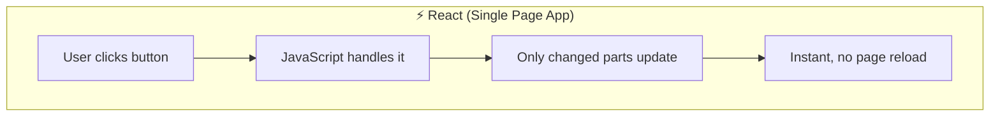

### 🔄 React ↔️ Python Translation Table

| React Concept | Python Equivalent | Example |
|--------------|-------------------|---------|
| **Component** | Function that returns HTML | `def Button(): return "<button>Click</button>"` |
| **Props** | Function arguments | `def greet(name): ...` |
| **State (`useState`)** | Variable that triggers re-render | No direct equivalent - magic! |
| **Context** | Global variable | Like Flask's `g` or a singleton |
| **`fetch()`** | `requests.get()` | Same idea! |
| **JSX** | f-strings with HTML | `f"<div>{name}</div>"` |

### Understanding React Context (The "Brain" of Our App)

Our app uses React Context to share location and AQI data. Think of it as a **central message board** that all components can read and write to:

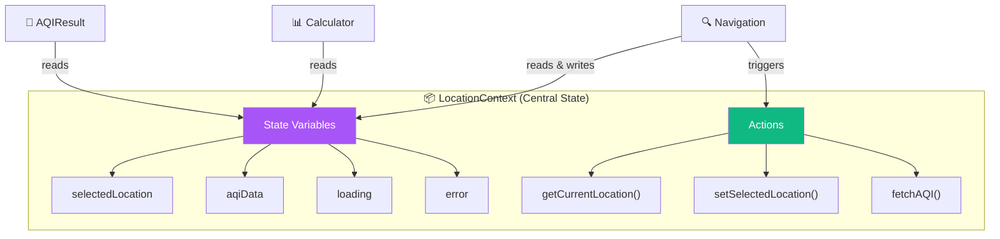

**Without Context (Messy!):**
```python
# You'd have to pass data through every function
def app():
    location = get_location()
    aqi_data = fetch_aqi(location)
    return navigation(location) + calculator(aqi_data, location)  # Tedious!
```

**With Context (Clean!):**
```python
# Any component can access shared state
class LocationContext:
    location = None
    aqi_data = None
    
ctx = LocationContext()  # Global - all components use this
```

### 📝 Side-by-Side Code Comparison

**Python:**
```python
def greeting(name):
    return f"<h1>Hello, {name}!</h1>"

greeting("Alice")  # Returns: <h1>Hello, Alice!</h1>
```

**React (same idea!):**
```jsx
function Greeting({ name }) {
    return <h1>Hello, {name}!</h1>
}

<Greeting name="Alice" />  // Renders: <h1>Hello, Alice!</h1>
```

### 🎯 The Key Difference: useState

In Python, changing a variable doesn't update the screen:
```python
count = 0
count = count + 1  # Nothing visible happens
print(count)       # You must explicitly output
```

In React, `useState` creates a "magic" variable that **automatically re-renders**:
```jsx
const [count, setCount] = useState(0)  // Initial value

setCount(count + 1)  // UI automatically shows new value!
```

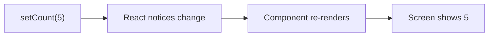

---

## 📊 Complete Data Flow

Here's the full journey from clicking "Allow Location" to seeing results:

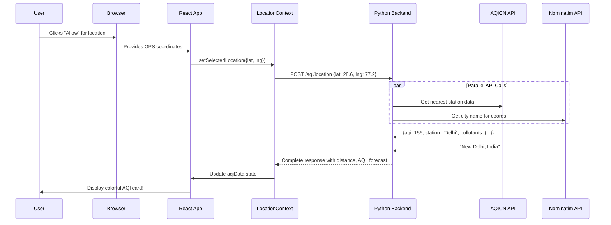

---

## 🔗 API Endpoints Summary

| Endpoint | Method | What It Does | Example |
|----------|--------|--------------|---------|
| `/health` | GET | Health check | Returns `{"status": "healthy"}` |
| `/aqi/location` | POST | Get AQI by coordinates | `{latitude: 28.6, longitude: 77.2}` |
| `/search` | GET | Search stations | `/search?keyword=Delhi` |
| `/aqi/station/{id}` | GET | Get specific station | `/aqi/station/@7397` |
| `/calculate-aqi` | POST | Manual AQI calculation | `{pm25: 35, pm10: 50}` |
| `/subscribe` | POST | Subscribe to alerts | `{method: "email", contact: "..."}` |
| `/feedback` | POST | Submit feedback | `{rating: 5, feedback: "Great!"}` |

---

## 📚 Documentation Guide

| Document | Who Should Read It | What You'll Learn |
|----------|-------------------|-------------------|
| [LOCAL_SETUP.md](LOCAL_SETUP.md) | Everyone | How to run the app locally |
| [backend/README.md](backend/README.md) | Python developers | FastAPI, AQICN integration |
| [frontend/README.md](frontend/README.md) | Frontend curious | React, components, state |
| [DEPLOYMENT.md](DEPLOYMENT.md) | DevOps / Going live | Google Cloud Run deployment |
| [GOOGLE_SHEETS_SETUP.md](GOOGLE_SHEETS_SETUP.md) | If using subscriptions | Google Sheets as database |

---

## 🤝 Contributing

Found a bug or want to improve something?

1. Fork the repository
2. Create a feature branch
3. Make your changes
4. Submit a pull request

---

## 📄 License

MIT License - feel free to use this for learning!

---

## 🙏 Acknowledgments

- 🌬️ Air quality data from [World Air Quality Index Project (AQICN)](https://aqicn.org/)
- 🚬 Cigarette equivalent research from [Berkeley Earth](http://berkeleyearth.org/)
- 🐍 Backend built with [FastAPI](https://fastapi.tiangolo.com/)
- ⚛️ Frontend built with [React](https://react.dev/)
- 📊 Analytics powered by [Google Analytics](https://analytics.google.com/)
