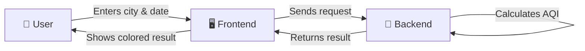
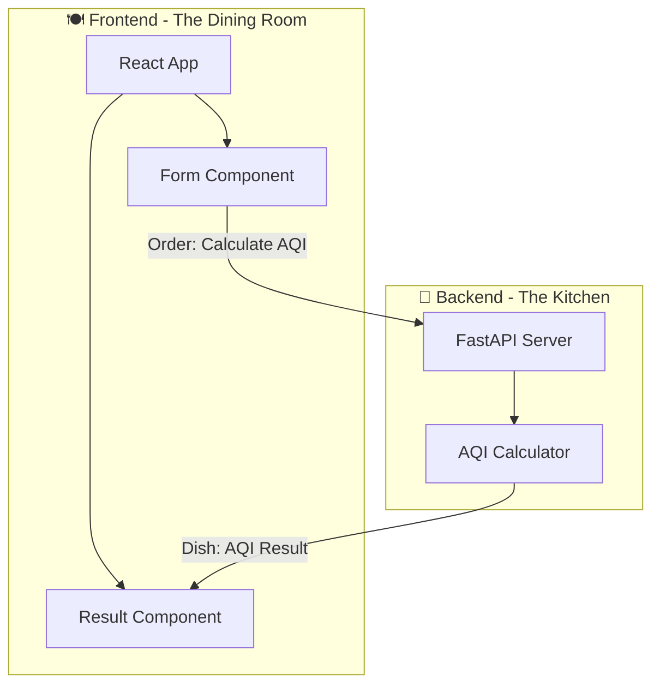
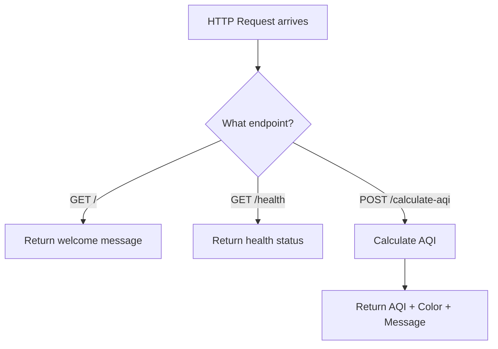
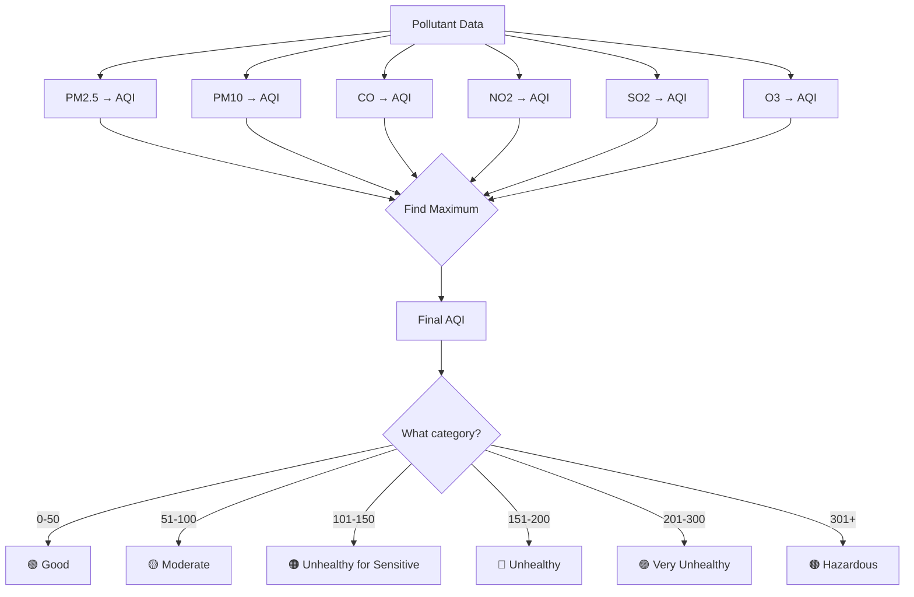
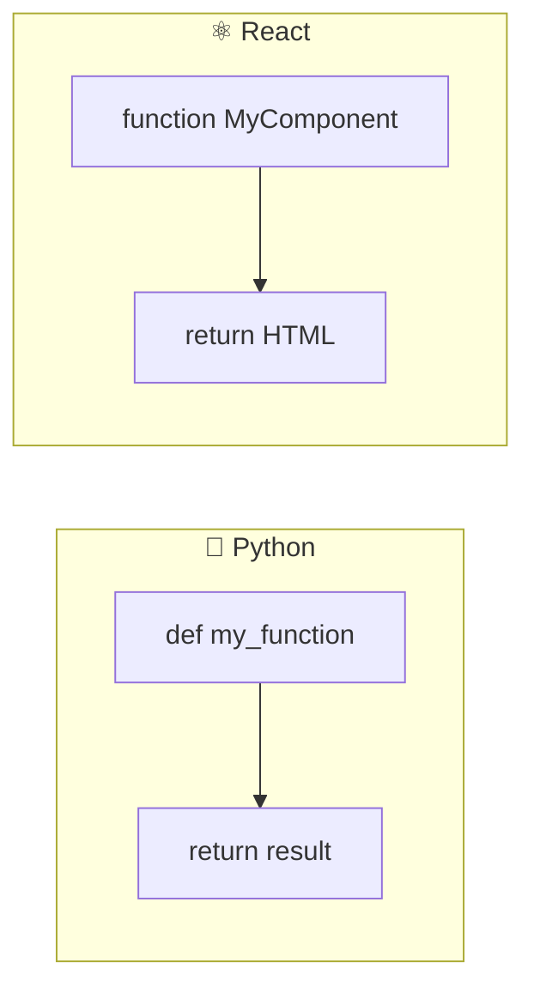
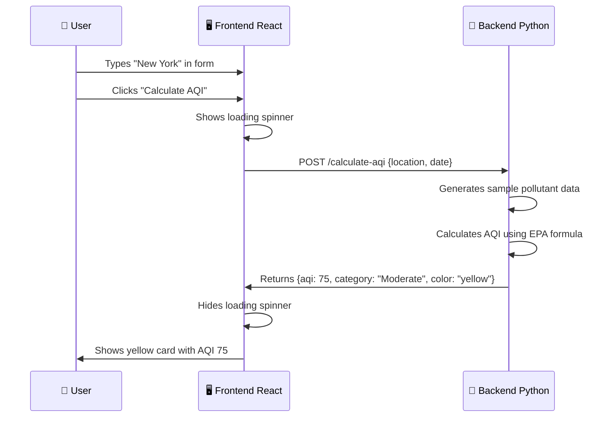
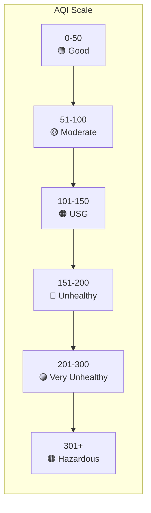

# 🌬️ AQI Calculator - A Beginner's Guide

Welcome! This is an **Air Quality Index (AQI) Calculator** web application. If you only know Python, don't worry — this guide will explain everything step by step.

---

## 🎯 What Does This App Do?



**Simple explanation:**
1. You enter a city name and date in the web page
2. The webpage sends this info to a Python server
3. Python calculates the Air Quality Index
4. The result comes back with colors (green = good, red = bad)

---

## 🏗️ Project Architecture

Think of this project as a **restaurant**:



| Component | Restaurant Analogy | Technology | You Know This? |
|-----------|-------------------|------------|----------------|
| **Frontend** | Dining room (what customers see) | React + JavaScript | ❌ New |
| **Backend** | Kitchen (where food is made) | Python + FastAPI | ✅ Yes! |
| **API** | Waiter (carries orders) | HTTP/JSON | 🔄 Similar to `requests` |

---

## 📁 Project Structure (Simplified)

```
AQI_Project/
├── 🐍 backend/          ← YOU CAN READ THIS! It is Python
│   ├── main.py          ← FastAPI server (like Flask)
│   └── aqi_calculator.py← The actual calculation logic
│
├── 🌐 frontend/         ← Don't worry about this yet
│   └── src/
│       ├── App.jsx      ← Main webpage
│       └── components/  ← Reusable parts
│
└── 📄 Documentation
    ├── README.md        ← You are here!
    ├── SETUP.md         ← How to run
    └── DEPLOYMENT.md    ← How to put online
```

---

## 🧠 How It Works - The Python Part (Backend)

This is the part you'll understand! Let's break it down:

### 1️⃣ The API Server (`main.py`)



**Think of FastAPI like Flask:**
```python
# Flask (you might know)          # FastAPI (what we use)
from flask import Flask            from fastapi import FastAPI
app = Flask(__name__)              app = FastAPI()

@app.route('/hello')               @app.get('/hello')
def hello():                       def hello():
    return {'msg': 'Hi'}               return {'msg': 'Hi'}
```

### 2️⃣ The AQI Calculation (`aqi_calculator.py`)



**The EPA formula in simple terms:**
```python
# For each pollutant, we use this formula:
AQI = ((I_high - I_low) / (C_high - C_low)) * (concentration - C_low) + I_low

# Where:
# - concentration = measured pollution level
# - C_low, C_high = pollution breakpoints (from EPA table)
# - I_low, I_high = AQI breakpoints (from EPA table)
```

---

## 🌐 The Frontend - Explained for Python Developers

Don't panic! React is just like Python functions, but for web pages.

### Python vs React Comparison



| Python Concept | React Equivalent | Example |
|---------------|------------------|---------|
| Function | Component | `function AQIForm()` |
| Variable | State | `const [location, setLocation] = useState('')` |
| Dictionary | Object | `{name: "John", age: 30}` |
| `requests.post()` | `fetch()` | `fetch(url, {method: 'POST'})` |
| `print()` | `console.log()` | Shows in browser console |

### Data Flow in the App



---

## 🚀 Quick Start

### Step 1: Start the Backend (Python)
```bash
cd backend
python -m venv venv
venv\Scripts\activate      # Windows
pip install -r requirements.txt
python main.py
```
✅ You'll see: `Uvicorn running on http://0.0.0.0:8000`

### Step 2: Start the Frontend
```bash
cd frontend
npm install
npm run dev
```
✅ You'll see: `Local: http://localhost:3000/`

### Step 3: Use the App
1. Open http://localhost:3000
2. Enter a city name
3. Pick a date
4. Click "Calculate AQI"
5. See the colorful result!

---

## 📊 Understanding the AQI Scale



| AQI | What It Means | Who's Affected |
|-----|--------------|----------------|
| 0-50 | Great air! Go outside! | Nobody |
| 51-100 | Okay for most people | Very sensitive people |
| 101-150 | Sensitive groups be careful | Elderly, children, asthmatics |
| 151-200 | Everyone might feel it | Everyone |
| 201-300 | Health alert! | Everyone seriously |
| 301+ | Emergency! Stay inside | Everyone - dangerous |

---

## 🔗 Key Files to Study

### If you want to understand the Python code:

1. **Start here:** [backend/main.py](backend/main.py)
   - This is the FastAPI server (similar to Flask)
   - Has 3 endpoints: `/`, `/health`, `/calculate-aqi`

2. **Then read:** [backend/aqi_calculator.py](backend/aqi_calculator.py)
   - Contains the actual AQI calculation
   - Uses EPA standard breakpoint tables
   - Pure Python math - no magic!

### If you want to understand the frontend (optional):

3. **Main app:** [frontend/src/App.jsx](frontend/src/App.jsx)
   - Think of it as the "main.py" of the frontend
   - Manages the overall page

4. **Form component:** [frontend/src/components/AQIForm.jsx](frontend/src/components/AQIForm.jsx)
   - The input form (like an HTML form)

5. **Result component:** [frontend/src/components/AQIResult.jsx](frontend/src/components/AQIResult.jsx)
   - Shows the colorful AQI result

---

## 📚 Next Steps

| Document | What You'll Learn |
|----------|------------------|
| [SETUP.md](SETUP.md) | Detailed setup instructions |
| [PYTHON_GUIDE.md](PYTHON_GUIDE.md) | Deep dive into the Python code |
| [DEPLOYMENT.md](DEPLOYMENT.md) | How to put this on the internet |

---

## ❓ Common Questions

**Q: Why not just use Python for everything?**
> A: You could! But React makes beautiful, interactive UIs easier. Think of it as using the right tool for the job.

**Q: Do I need to learn JavaScript?**
> A: Not really for this project. The Python backend is where the logic lives. The frontend is "ready to use."

**Q: What's the difference between FastAPI and Flask?**
> A: FastAPI is faster, has automatic documentation, and validates data automatically. It's like Flask 2.0.

---

## 🎉 Congratulations!

You now understand:
- ✅ How frontend and backend communicate
- ✅ What each file does
- ✅ How AQI is calculated
- ✅ How to run the project

**Happy coding!** 🐍✨
