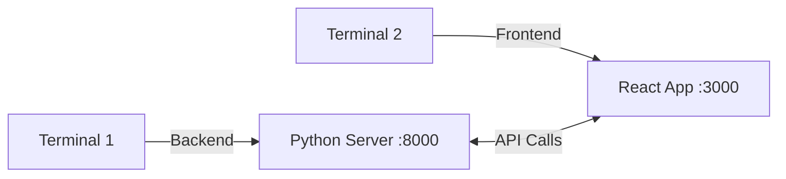

# 🛠️ Setup Guide

Get the AQI Calculator running on your computer in 5 minutes!

---

## 📋 Prerequisites

Before starting, make sure you have:

| Software | Check Command | Download |
|----------|--------------|----------|
| Python 3.8+ | `python --version` | [python.org](https://python.org) |
| Node.js 16+ | `node --version` | [nodejs.org](https://nodejs.org) |
| npm | `npm --version` | Comes with Node.js |

---

## 🚀 Quick Start (2 Terminals)



### Terminal 1: Start Backend (Python)

```bash
cd backend
python -m venv venv
venv\Scripts\activate      # Windows
# source venv/bin/activate # Mac/Linux
pip install -r requirements.txt
python main.py
```

✅ **Success:** You see `Uvicorn running on http://0.0.0.0:8000`

### Terminal 2: Start Frontend

```bash
cd frontend
npm install
npm run dev
```

✅ **Success:** You see `Local: http://localhost:3000/`

---

## 🌐 Open the App

| What | URL |
|------|-----|
| 🖥️ **App** | http://localhost:3000 |
| 📚 **API Docs** | http://localhost:8000/docs |
| ❤️ **Health Check** | http://localhost:8000/health |

---

## 🐛 Troubleshooting

### Problem: "python not found"
```bash
# Try python3 instead
python3 --version
python3 -m venv venv
```

### Problem: "npm not found"
- Download Node.js from [nodejs.org](https://nodejs.org)
- Restart your terminal after installation

### Problem: Port already in use
```bash
# Find what's using the port (Windows)
netstat -ano | findstr :8000

# Kill it (replace PID with the number you found)
taskkill /PID <PID> /F
```

### Problem: CORS error in browser
- Make sure the backend is running on port 8000
- Check browser console (F12) for detailed errors

### Problem: "Failed to fetch"
- Backend isn't running → Start it first!
- Check if http://localhost:8000/health returns `{"status": "healthy"}`

---

## ✅ Verify Everything Works

1. **Backend health:** Visit http://localhost:8000/health
   - Should show: `{"status": "healthy"}`

2. **API docs:** Visit http://localhost:8000/docs
   - Should show Swagger UI

3. **Frontend:** Visit http://localhost:3000
   - Should show the AQI Calculator form

4. **Full test:**
   - Enter "New York" as location
   - Click "Today" for date
   - Click "Calculate AQI"
   - Should see a colored result!

---

## 📖 Next Steps

| Guide | What You'll Learn |
|-------|------------------|
| [README.md](README.md) | Project overview with diagrams |
| [PYTHON_GUIDE.md](PYTHON_GUIDE.md) | Understand all the Python code |
| [DEPLOYMENT.md](DEPLOYMENT.md) | Put your app on the internet |

---

## 🎯 Quick Reference Card

```
# Backend (Terminal 1)
cd backend
venv\Scripts\activate
python main.py
→ http://localhost:8000

# Frontend (Terminal 2)  
cd frontend
npm run dev
→ http://localhost:3000
```

**Happy coding! 🐍✨**
