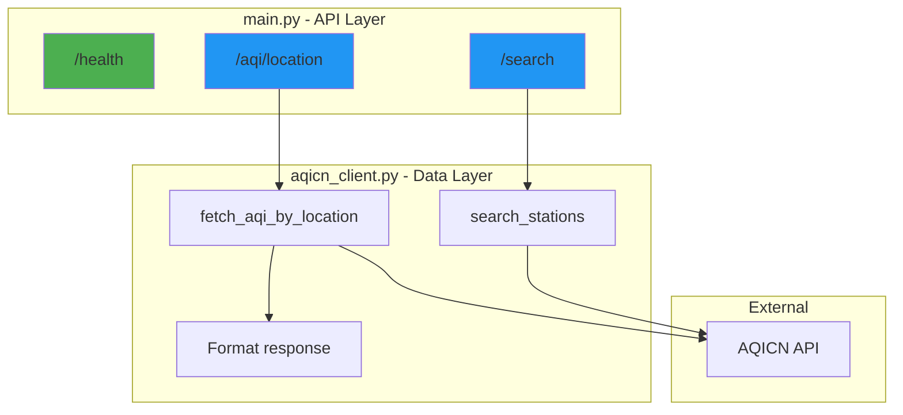
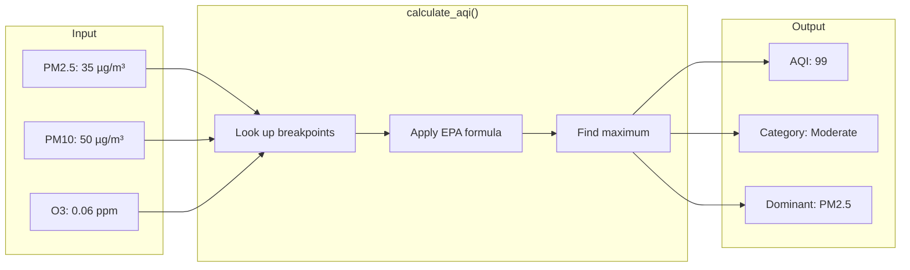

# 🐍 Backend - FastAPI Server

Welcome to the Python backend! Since you know Python, **you can read and understand all of this code**.

This document explains the architecture, how FastAPI works, and walks through the key code patterns.

---

## 📁 File Overview

```
backend/
├── main.py              ← API server (endpoints live here)
├── aqi_calculator.py    ← AQI calculation logic (EPA formula)
├── aqicn_client.py      ← HTTP client for AQICN API
├── requirements.txt     ← Python dependencies
├── Dockerfile           ← Container config (for deployment)
└── .env                 ← Environment variables (API keys)
```

---

## 🏗️ Architecture



### Data Flow for /aqi/location

```mermaid
sequenceDiagram
    participant Frontend
    participant main.py
    participant aqicn_client.py
    participant AQICN API

    Frontend->>main.py: POST /aqi/location {lat, lng}
    main.py->>aqicn_client.py: fetch_aqi_by_location(lat, lng)
    aqicn_client.py->>AQICN API: GET /feed/geo:lat;lng
    AQICN API-->>aqicn_client.py: Raw JSON data
    Note over aqicn_client.py: Extract AQI, station info,<br/>pollutants, forecast
    aqicn_client.py-->>main.py: Formatted dict
    main.py-->>Frontend: JSON response
```

### Separation of Concerns

| File | Responsibility | Depends On |
|------|---------------|------------|
| `main.py` | HTTP handling, request/response | `aqicn_client.py` |
| `aqicn_client.py` | External API communication & formatting | Nothing |
| `aqi_calculator.py` | Pure calculation logic (for manual input) | Nothing |

> 💡 **Simplified Architecture**: The AQICN API provides pre-calculated AQI values using EPA standards.
> We use these values directly rather than recalculating, reducing complexity and ensuring accuracy.

---

## 🚀 FastAPI Primer

FastAPI is a modern Python web framework. If you know Flask, you'll feel right at home!

### Flask vs FastAPI Comparison

```python
# Flask
from flask import Flask, request, jsonify
app = Flask(__name__)

@app.route('/hello', methods=['POST'])
def hello():
    data = request.get_json()
    return jsonify({'message': f"Hello, {data['name']}"})

# FastAPI (same thing!)
from fastapi import FastAPI
from pydantic import BaseModel

app = FastAPI()

class HelloRequest(BaseModel):
    name: str

@app.post('/hello')
def hello(data: HelloRequest):
    return {'message': f"Hello, {data.name}"}
```

### Key Differences

| Feature | Flask | FastAPI |
|---------|-------|---------|
| Request parsing | `request.get_json()` | Automatic via Pydantic |
| Validation | Manual | Automatic via type hints |
| Docs | Manual (Swagger separate) | Auto-generated at `/docs` |
| Async support | Limited | Built-in |
| Type hints | Optional | Encouraged |

---

## 📖 Code Walkthrough

### 1. Entry Point (`main.py`)

Let's break down the key parts:

#### Imports and Setup
```python
from fastapi import FastAPI, HTTPException
from fastapi.middleware.cors import CORSMiddleware
from pydantic import BaseModel, Field

# Create the app instance
app = FastAPI(
    title="AQI Calculator API",
    description="Air Quality Index calculator with real-time data",
    version="3.0.0"
)

# CORS: Allow frontend (different port) to call our API
app.add_middleware(
    CORSMiddleware,
    allow_origins=["*"],  # In production, list specific origins
    allow_methods=["*"],
    allow_headers=["*"],
)
```

> 💡 **CORS Explained**: Browsers block requests between different origins (ports count!). 
> Frontend runs on `localhost:3000`, backend on `localhost:8000`. 
> CORS middleware tells the browser "it's okay, allow this".

#### Request/Response Models (Pydantic)
```python
class LocationAQIRequest(BaseModel):
    """Request model for fetching AQI by coordinates."""
    latitude: float = Field(..., ge=-90, le=90)   # Must be between -90 and 90
    longitude: float = Field(..., ge=-180, le=180)

class LocationAQIResponse(BaseModel):
    """Response model for AQI data."""
    station_name: str
    aqi: Optional[int] = None
    category: str
    color: str
    pollutant_breakdown: Optional[dict] = None  # Individual pollutant AQIs
    # ... more fields
```

> 💡 **Why Pydantic?** 
> - Automatic validation (latitude must be -90 to 90)
> - Auto-generated documentation
> - Type safety
> - Clear API contracts

#### Endpoint Definition
```python
@app.post("/aqi/location", response_model=LocationAQIResponse)
async def get_aqi_by_location(request: LocationAQIRequest):
    """
    Get AQI for a specific latitude/longitude.
    Finds the nearest monitoring station.
    """
    try:
        # Call our AQICN client - it handles all the formatting
        data = fetch_aqi_by_location(
            request.latitude, 
            request.longitude
        )
        
        # Return structured response
        return LocationAQIResponse(
            station_name=data.get("station_name", "Unknown"),
            aqi=data.get("aqi"),
            category=data.get("category", "Unknown"),
            pollutant_breakdown=data.get("pollutant_breakdown"),
            # ... map all fields
        )
    except Exception as e:
        raise HTTPException(status_code=500, detail=str(e))
```

---

### 2. AQICN Client (`aqicn_client.py`)

This file handles all communication with the external AQICN API and formats the response.

```mermaid
sequenceDiagram
    participant Main as main.py
    participant Client as aqicn_client.py
    participant API as AQICN API

    Main->>Client: fetch_aqi_by_location(lat, lng)
    Client->>Client: Build URL with API token
    Client->>API: GET /feed/geo:lat;lng/
    API-->>Client: JSON response
    Client->>Client: Parse & extract data
    Client->>Client: Format pollutants
    Client->>Client: Get category & message
    Client-->>Main: Structured dict
```

#### Key Function
```python
def fetch_aqi_by_location(latitude: float, longitude: float) -> dict:
    """
    Fetch AQI data for coordinates from AQICN API.
    
    Note: The AQICN API already provides AQI values directly,
    so we use them as-is rather than recalculating.
    """
    client = get_aqicn_client()
    data = client.get_aqi_by_coordinates(latitude, longitude)
    
    # Get AQI directly from API - this is the primary value
    aqi = data.get("aqi")
    category, color = get_aqi_category(aqi) if aqi else ("Unknown", "#808080")
    message = get_health_message(aqi) if aqi else "No data available"
    
    # Format pollutants for display
    measurements = []
    pollutant_aqis = {}
    
    for param, value in data.get("pollutants", {}).items():
        measurements.append({
            "parameter": param,
            "display_name": POLLUTANT_NAMES.get(param, param.upper()),
            "value": value,
            "unit": POLLUTANT_UNITS.get(param, "AQI")
        })
        # Collect air quality pollutants
        if param in ['pm25', 'pm10', 'o3', 'no2', 'so2', 'co']:
            pollutant_aqis[POLLUTANT_NAMES.get(param)] = value
    
    return {
        "station_id": data.get("station_id"),
        "station_name": data.get("station_name"),
        "aqi": aqi,  # Direct from API
        "category": category,
        "color": color,
        "message": message,
        "pollutant_breakdown": pollutant_aqis,
        "measurements": measurements,
        # ... more fields
    }
```

> 💡 **Why Use AQI Directly?** 
> The AQICN API provides pre-calculated AQI values using EPA standards.
> There's no need to recalculate - we use them directly for accuracy.

> 💡 **httpx vs requests**: `httpx` is like `requests` but supports async. 
> Same API: `httpx.get(url)` works just like `requests.get(url)`.

---

### 3. AQI Calculator (`aqi_calculator.py`)

This file contains pure Python logic for manual AQI calculations (when users input raw pollutant concentrations instead of using location lookup).



> 💡 **Note**: For location-based AQI lookups, we use the AQI values directly from the AQICN API.
> This calculator is primarily for manual pollutant concentration input.

#### The AQI Formula

The EPA uses this piecewise linear formula:

```
AQI = ((I_high - I_low) / (C_high - C_low)) × (C - C_low) + I_low
```

Where:
- `C` = Pollutant concentration
- `C_low`, `C_high` = Breakpoint concentrations
- `I_low`, `I_high` = AQI values at breakpoints

#### Code Implementation
```python
# Breakpoint tables (EPA standard)
EPA_PM25_BREAKPOINTS = [
    # (C_low, C_high, I_low, I_high)
    (0.0,    9.0,    0,   50),    # Good
    (9.1,   35.4,   51,  100),    # Moderate
    (35.5,  55.4,  101,  150),    # Unhealthy for Sensitive Groups
    (55.5, 125.4,  151,  200),    # Unhealthy
    # ... more breakpoints
]

def calculate_aqi_for_pollutant(concentration: float, breakpoints: list) -> int:
    """
    Calculate AQI for a single pollutant using EPA formula.
    """
    for c_low, c_high, i_low, i_high in breakpoints:
        if c_low <= concentration <= c_high:
            # Apply the formula
            aqi = ((i_high - i_low) / (c_high - c_low)) * (concentration - c_low) + i_low
            return round(aqi)
    
    # Above highest breakpoint = Hazardous
    return breakpoints[-1][3]

def calculate_aqi(pollutants: dict, standard: AQIStandard = AQIStandard.EPA) -> dict:
    """
    Calculate overall AQI from multiple pollutants.
    
    The overall AQI is the MAXIMUM of individual pollutant AQIs.
    """
    aqi_values = {}
    
    for pollutant, concentration in pollutants.items():
        if concentration is not None:
            breakpoints = BREAKPOINT_TABLE[pollutant]
            aqi_values[pollutant] = calculate_aqi_for_pollutant(concentration, breakpoints)
    
    # Overall AQI = Maximum individual AQI
    max_aqi = max(aqi_values.values())
    dominant = max(aqi_values, key=aqi_values.get)
    
    category, color, message = get_aqi_category(max_aqi, standard)
    
    return {
        'aqi': max_aqi,
        'category': category,
        'color': color,
        'dominant_pollutant': dominant,
        'message': message
    }
```

---

## 🔌 API Endpoints Reference

| Method | Endpoint | Description | Request Body |
|--------|----------|-------------|--------------|
| GET | `/` | Welcome message | - |
| GET | `/health` | Health check | - |
| POST | `/aqi/location` | Get AQI by coordinates | `{latitude, longitude}` |
| GET | `/search?keyword=...` | Search stations | - |
| GET | `/aqi/station/{id}` | Get AQI for station | - |
| POST | `/calculate-aqi` | Calculate AQI from pollutant data | `{location, date, pm25?, pm10?, ...}` |

### Response Format for `/aqi/location`

```json
{
  "station_id": 12345,
  "station_name": "Delhi, India",
  "aqi": 156,
  "category": "Unhealthy",
  "color": "#ff0000",
  "message": "Some members of the general public may experience health effects...",
  "pollutant_breakdown": {
    "PM2.5": 156,
    "PM10": 89,
    "O3": 45
  },
  "dominant_pollutant": "PM2.5",
  "measurements": [
    {"parameter": "pm25", "display_name": "PM2.5", "value": 156, "unit": "AQI"},
    {"parameter": "t", "display_name": "Temperature", "value": 28.5, "unit": "°C"}
  ],
  "forecast": {...},
  "coordinates": {"latitude": 28.6, "longitude": 77.2}
}
```

### Try It Yourself!

1. Start the server: `python main.py`
2. Open http://localhost:8000/docs
3. Click any endpoint → "Try it out" → "Execute"

---

## 🔧 Running the Backend

```bash
# Navigate to backend
cd backend

# Create virtual environment
python -m venv .venv

# Activate it
# Windows:
.venv\Scripts\activate
# Linux/Mac:
source .venv/bin/activate

# Install dependencies
pip install -r requirements.txt

# Set up environment (create .env file)
echo "AQICN_API_TOKEN=your_token_here" > .env

# Run!
python main.py
```

Server starts at http://localhost:8000

---

## 📦 Dependencies Explained

```txt
fastapi          # Web framework
uvicorn          # ASGI server (runs FastAPI)
httpx            # HTTP client (like requests, async-capable)
python-dotenv    # Load .env files
pydantic         # Data validation
```

> 💡 **ASGI vs WSGI**: 
> - WSGI (Flask default): Synchronous, one request at a time
> - ASGI (FastAPI/uvicorn): Async-capable, handles concurrent requests

---

## 🧪 Testing the API

### Using curl
```bash
# Health check
curl http://localhost:8000/health

# Get AQI for Delhi
curl -X POST http://localhost:8000/aqi/location \
  -H "Content-Type: application/json" \
  -d '{"latitude": 28.6139, "longitude": 77.2090}'
```

### Using Python
```python
import requests

# Get AQI for Delhi
response = requests.post(
    "http://localhost:8000/aqi/location",
    json={"latitude": 28.6139, "longitude": 77.2090}
)
print(response.json())
```

---

## 📚 Next Steps

1. **Read the code** - Start with `aqicn_client.py` (data fetching & formatting)
2. **Modify an endpoint** - Add a new field to the response
3. **Add a new endpoint** - Try creating `/aqi/cities` that returns hardcoded cities
4. **Explore the frontend** - See how it calls these endpoints → [frontend/README.md](../frontend/README.md)
