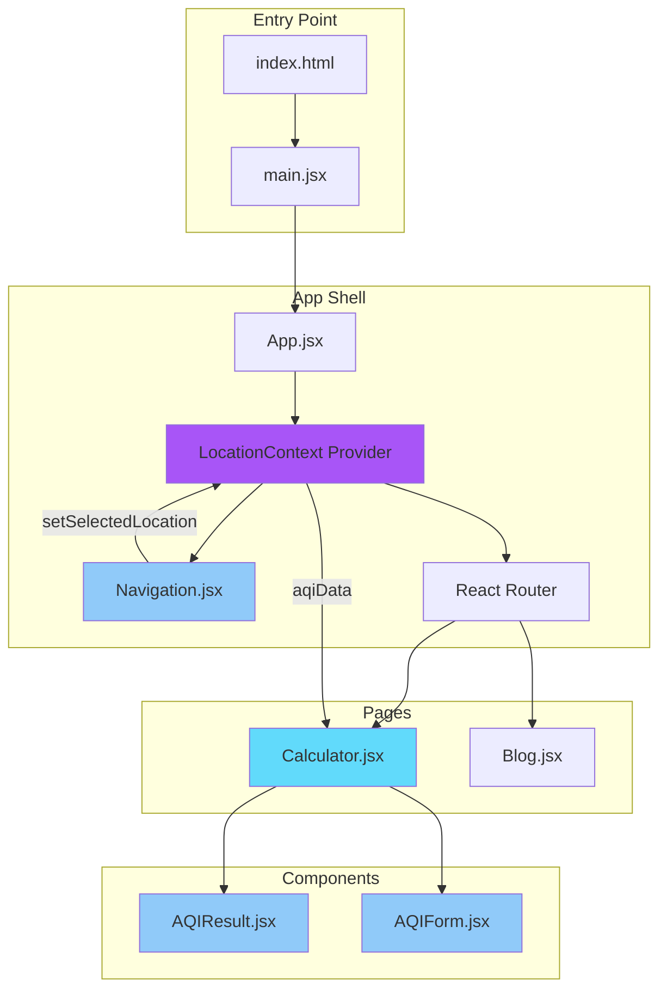
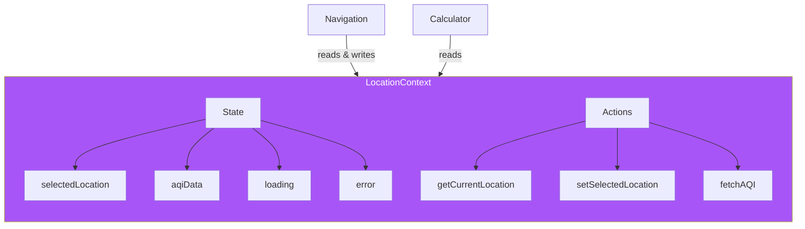
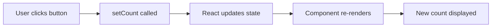
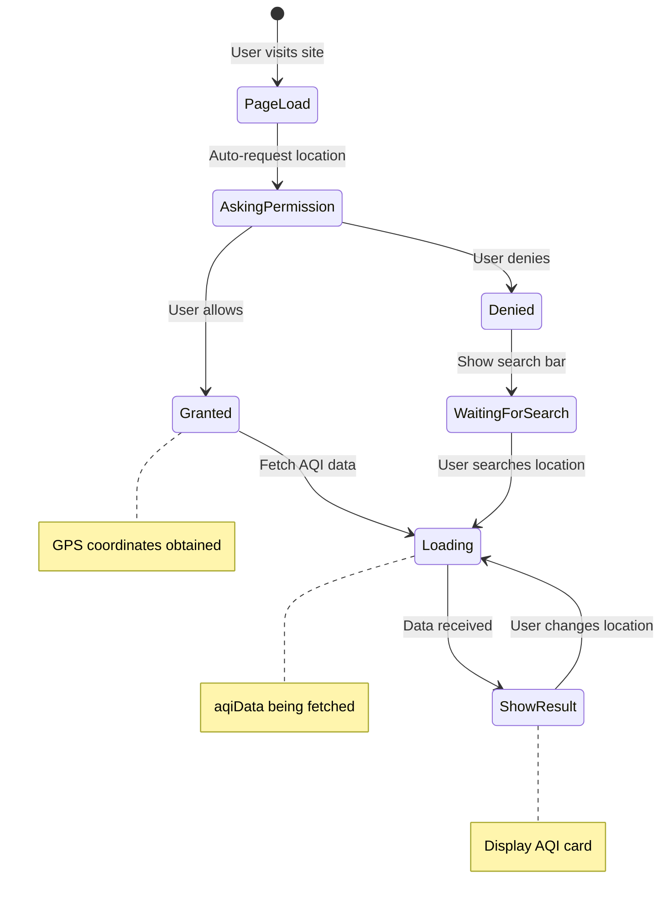
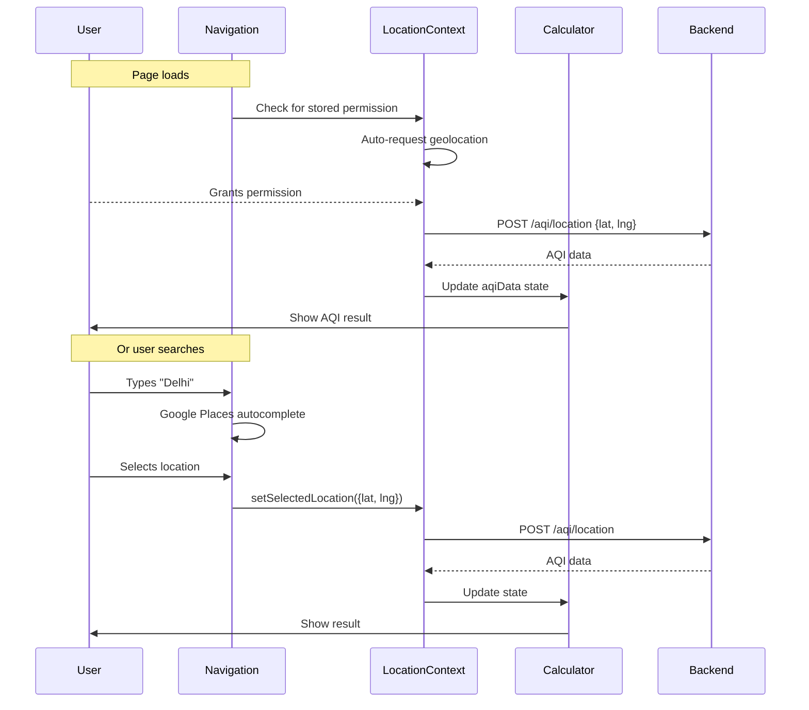

# ⚛️ Frontend - React Application (aqitoday.in)

Welcome to the React frontend for **aqitoday.in**! This document explains React concepts, the project structure, and walks through the code.

> **Don't panic!** React looks different from Python, but the concepts are similar. This guide will help you understand.

---

## 📁 File Overview

```
frontend/
├── src/
│   ├── main.jsx           ← Entry point (like if __name__ == "__main__")
│   ├── App.jsx            ← Main component with routing & context
│   ├── index.css          ← Global styles (Tailwind CSS)
│   ├── contexts/
│   │   └── LocationContext.jsx ← Shared state for location & AQI
│   ├── pages/
│   │   ├── Calculator.jsx ← Main AQI calculator page
│   │   └── Blog.jsx       ← Blog page
│   └── components/
│       ├── Navigation.jsx ← Top nav bar with location search
│       ├── AQIResult.jsx  ← AQI result display with cigarette equivalent
│       └── AQIForm.jsx    ← Manual AQI input form
├── index.html             ← HTML template
├── package.json           ← Dependencies (like requirements.txt)
├── vite.config.js         ← Build tool config
├── tailwind.config.js     ← CSS framework config
└── Dockerfile             ← Container config for deployment
```

---

## 🏗️ Architecture



### Component Hierarchy

```
App
├── LocationContext Provider (shared state)
│   ├── Navigation (location search bar - always visible)
│   └── Routes
│       ├── "/" → Calculator
│       │         ├── AQIResult (results display)
│       │         └── AQIForm (manual input form)
│       └── "/blog" → Blog
```

---

## 🔄 State Management with Context

The app uses React Context to share location and AQI data across all components:



### Why Context?

Without Context, you'd have to pass data through every component:
```jsx
// Without Context (prop drilling - messy!)
<App>
  <Navigation onLocationChange={handleChange} selectedLocation={location} />
  <Calculator aqiData={data} loading={loading} error={error} />
</App>
```

With Context, any component can access the shared state:
```jsx
// With Context (clean!)
<LocationProvider>  {/* Provides state to all children */}
  <Navigation />    {/* Uses useLocation() hook */}
  <Calculator />    {/* Uses useLocation() hook */}
</LocationProvider>
```

---

## ⚛️ React Fundamentals

Before reading the code, let's understand the key concepts.

### 1. Components = Functions That Return HTML

```jsx
// This is a React component
function Greeting({ name }) {
    return <h1>Hello, {name}!</h1>
}

// Using it (like calling a function)
<Greeting name="Alice" />  // Renders: <h1>Hello, Alice!</h1>
```

**Python equivalent:**
```python
def greeting(name):
    return f"<h1>Hello, {name}!</h1>"

greeting("Alice")  # Returns: <h1>Hello, Alice!</h1>
```

### 2. Props = Function Arguments

```jsx
// Props are passed like HTML attributes
<AQIResult data={aqiData} loading={false} />

// Inside AQIResult component:
function AQIResult({ data, loading }) {
    // data and loading are now available
    return <div>{data.aqi}</div>
}
```

**Python equivalent:**
```python
def aqi_result(data, loading):
    return f"<div>{data['aqi']}</div>"

aqi_result(data=aqi_data, loading=False)
```

### 3. State = Variables That Update The UI

This is the key difference from regular Python:

```python
# Python - changing variable doesn't update display
count = 0
count = count + 1  # Nothing visible happens
print(count)       # You must explicitly output
```

```jsx
// React - useState creates a "reactive" variable
const [count, setCount] = useState(0)

// When you call setCount, the UI automatically updates!
setCount(count + 1)  // UI shows new value immediately

// Why two values? 
// count = current value (read-only)
// setCount = function to update it
```



### 4. Context = Shared Global State

```jsx
// Create context (like a global state container)
const LocationContext = createContext()

// Provider wraps app and provides state
function LocationProvider({ children }) {
    const [aqiData, setAqiData] = useState(null)
    
    return (
        <LocationContext.Provider value={{ aqiData, setAqiData }}>
            {children}
        </LocationContext.Provider>
    )
}

// Any child component can use the context
function Calculator() {
    const { aqiData } = useContext(LocationContext)
    return <div>AQI: {aqiData?.aqi}</div>
}
```

**Python equivalent (conceptually):**
```python
# Like a singleton/global object
class LocationContext:
    _instance = None
    
    def __new__(cls):
        if not cls._instance:
            cls._instance = super().__new__(cls)
            cls._instance.aqi_data = None
        return cls._instance

# Any module can access it
ctx = LocationContext()
print(ctx.aqi_data)
```

### 5. JSX = HTML Inside JavaScript

JSX looks like HTML but it's JavaScript:

```jsx
// Curly braces {} = "insert JavaScript here"
function Welcome({ user }) {
    return (
        <div className="card">
            <h1>Hello, {user.name}!</h1>           {/* Variable */}
            <p>You have {user.messages} messages</p>
            {user.isAdmin && <span>👑 Admin</span>} {/* Conditional */}
        </div>
    )
}
```

**Python f-string comparison:**
```python
f"""
<div class="card">
    <h1>Hello, {user['name']}!</h1>
    <p>You have {user['messages']} messages</p>
    {'<span>👑 Admin</span>' if user['is_admin'] else ''}
</div>
"""
```

### 6. useEffect = Run Code When Component Loads

```jsx
function UserProfile({ userId }) {
    const [user, setUser] = useState(null)
    
    // This runs AFTER the component renders
    useEffect(() => {
        // Fetch user data when component mounts
        fetch(`/api/users/${userId}`)
            .then(res => res.json())
            .then(data => setUser(data))
    }, [userId])  // Re-run if userId changes
    
    return <div>{user ? user.name : 'Loading...'}</div>
}
```

**Python equivalent (conceptually):**
```python
class UserProfile:
    def __init__(self, user_id):
        self.user = None
        self._load_user(user_id)  # Called after init
    
    def _load_user(self, user_id):
        self.user = requests.get(f"/api/users/{user_id}").json()
```

---

## 📖 Code Walkthrough

### Entry Point: `main.jsx`

```jsx
import React from 'react'
import ReactDOM from 'react-dom/client'
import App from './App.jsx'
import './index.css'

// Find the <div id="root"> in index.html and render our app there
ReactDOM.createRoot(document.getElementById('root')).render(
  <React.StrictMode>
    <App />
  </React.StrictMode>,
)
```

**Python equivalent:**
```python
if __name__ == "__main__":
    app = App()
    render(app, target="root")
```

### App Shell: `App.jsx`

```jsx
import { BrowserRouter as Router, Routes, Route } from 'react-router-dom'
import { LocationProvider } from './contexts/LocationContext'
import Navigation from './components/Navigation'
import Calculator from './pages/Calculator'
import Blog from './pages/Blog'

function App() {
  return (
    <LocationProvider>        {/* Shared state for all components */}
      <Router>
        <div className="min-h-screen bg-gradient-to-br from-slate-50 via-blue-50 to-indigo-50">
          <Navigation />      {/* Location search always visible */}
          <Routes>
            <Route path="/" element={<Calculator />} />
            <Route path="/blog" element={<Blog />} />
          </Routes>
        </div>
      </Router>
    </LocationProvider>
  )
}

export default App
```

**What this does:**
- Wraps entire app in `<LocationProvider>` for shared state
- Wraps app in `<Router>` for navigation
- Shows `<Navigation>` (with search) on every page
- Shows `<Calculator>` when URL is `/`
- Shows `<Blog>` when URL is `/blog`

### Location Context: `contexts/LocationContext.jsx`

This is the "brain" of the app - it manages all location and AQI state:

```jsx
function LocationProvider({ children }) {
  // Location state
  const [selectedLocation, setSelectedLocation] = useState(null)
  const [locationInput, setLocationInput] = useState('')
  
  // AQI data state  
  const [aqiData, setAqiData] = useState(null)
  const [loading, setLoading] = useState(false)
  const [error, setError] = useState(null)

  // Auto-request location on first load
  useEffect(() => {
    const hasAskedPermission = sessionStorage.getItem('locationPermissionAsked')
    if (!hasAskedPermission && navigator.geolocation) {
      sessionStorage.setItem('locationPermissionAsked', 'true')
      getCurrentLocation()  // Automatically ask for location!
    }
  }, [])

  // Fetch AQI when location is set
  const fetchAQI = async (latitude, longitude) => {
    setLoading(true)
    const response = await fetch(`${API_URL}/aqi/location`, {
      method: 'POST',
      body: JSON.stringify({ latitude, longitude }),
    })
    const data = await response.json()
    setAqiData(data)
    setLoading(false)
  }

  // Provide state to all children
  return (
    <LocationContext.Provider value={{ 
      selectedLocation, setSelectedLocation,
      aqiData, loading, error,
      getCurrentLocation, fetchAQI 
    }}>
      {children}
    </LocationContext.Provider>
  )
}
```



### Navigation Component: `components/Navigation.jsx`

The navigation bar contains the location search - always accessible:

```jsx
function Navigation() {
  const { 
    selectedLocation, 
    setSelectedLocation, 
    locationInput, 
    setLocationInput,
    getCurrentLocation,
    loading 
  } = useLocation()  // Get state from context
  
  // Google Places autocomplete for search
  const handleSelectPrediction = async (prediction) => {
    const place = new window.google.maps.places.Place({ id: prediction.placeId })
    await place.fetchFields({ fields: ['location'] })
    
    // This triggers AQI fetch via context
    setSelectedLocation({
      name: prediction.description,
      latitude: place.location.lat(),
      longitude: place.location.lng()
    })
  }

  // Auto-clear input on focus for better UX
  const handleInputFocus = () => {
    setLocationInput('')
    setSelectedLocation(null)
  }

  return (
    <nav className="...">
      {/* Logo - aqitoday.in with wind/air icon */}
      <Link to="/">
        <div className="w-9 h-9 bg-gradient-to-br from-indigo-500 to-purple-600 rounded-xl">
          <svg className="w-5 h-5 text-white" fill="none" stroke="currentColor" viewBox="0 0 24 24">
            {/* Wind/Air icon representing air quality */}
            <path strokeLinecap="round" strokeLinejoin="round" strokeWidth={2} d="M14 5l7 7m0 0l-7 7m7-7H3" />
          </svg>
        </div>
        <span>aqitoday.in</span>
      </Link>
      
      {/* Search bar with auto-clear on focus */}
      <input 
        value={locationInput}
        onChange={(e) => setLocationInput(e.target.value)}
        onFocus={handleInputFocus}  // Clears input when clicked
        placeholder="Search location..."
      />
        onChange={(e) => setLocationInput(e.target.value)}
        placeholder="Search location..."
      />
      
      {/* My Location button */}
      <button onClick={getCurrentLocation}>
        Use My Location
      </button>
      
      {/* Selected location indicator */}
      {selectedLocation && (
        <span>{selectedLocation.name}</span>
      )}
    </nav>
  )
}
```

### Calculator Page: `pages/Calculator.jsx`

The main page - now much simpler because state is in context:

```jsx
function Calculator() {
  const { aqiData, loading, error, locationPermission } = useLocation()

  return (
    <div className="min-h-screen">
      {/* Show hero when no data */}
      {!aqiData && !loading && !error && (
        <div className="text-center">
          <h1>Check Your Air Quality</h1>
          {locationPermission === 'denied' && (
            <p>Location denied. Use search bar above.</p>
          )}
        </div>
      )}

      {/* Loading state */}
      {loading && <LoadingSpinner />}

      {/* Error state */}
      {error && <ErrorMessage message={error} />}

      {/* Results */}
      {aqiData && !loading && <AQIResult data={aqiData} />}
    </div>
  )
}
```

### Result Component: `components/AQIResult.jsx`

Displays the AQI data with a clean, uncluttered design:

```jsx
function AQIResult({ data }) {
  const [isPollutantsExpanded, setIsPollutantsExpanded] = useState(false)
  const { aqi, category, location, message, pollutant_breakdown, forecast, dominant_pollutant } = data

  // Calculate cigarette equivalent (22 µg/m³ PM2.5 ≈ 1 cigarette)
  const cigarettes = getCigaretteEquivalent(aqi)

  return (
    <div className="bg-white rounded-2xl shadow-lg">
      {/* Compact Header with AQI */}
      <div className="p-5 bg-light-colored">
        <div className="flex items-center gap-4">
          {/* AQI Circle */}
          <div className="w-24 h-24 rounded-full" style={{ backgroundColor: colors.bg }}>
            <span className="text-4xl font-black">{aqi}</span>
          </div>
          
          {/* Status & Location */}
          <div>
            <div>{getAQIEmoji(aqi)} {category}</div>
            
            {/* Station info - Shows "Based on monitoring station closest to you" */}
            <div>
              <span>📍 Based on the monitoring station closest to you</span>
              {/* Station name displayed below */}
              {location && <div className="font-medium">{location}</div>}
            </div>
          </div>
        </div>
      </div>

      {/* Info Grid - Visible by default */}
      <div className="p-5 space-y-4">
        {/* Cigarette Equivalent & Main Pollutant with Animated Smoke */}
        <div className="grid grid-cols-2 gap-3">
          <div>🚬 {cigarettes} cigarettes/day</div>
          <div>💨 Main Pollutant: {dominant_pollutant}</div>
        </div>

        {/* Health Advice */}
        <div>💡 {message}</div>

        {/* Forecast - Always visible */}
        {forecast && <div>📅 Forecast: ...</div>}

        {/* Collapsible "Explore Pollutants" Section */}
        {pollutant_breakdown && (
          <div>
            <button onClick={() => setIsPollutantsExpanded(!isPollutantsExpanded)}>
              🔍 Explore Pollutants
            </button>
            
            {isPollutantsExpanded && (
              <div className="grid grid-cols-3 gap-3">
                {Object.entries(pollutant_breakdown).map(([name, value]) => (
                  <div key={name}>{name}: {value}</div>
                ))}
              </div>
            )}
          </div>
        )}
      </div>

      {/* Pollutant Level Indicator - Left as is */}
      <div className="px-5 pb-5">
        <div className="flex rounded-lg h-2">
          <div className="flex-1 bg-emerald-500"></div>
          <div className="flex-1 bg-amber-500"></div>
          <div className="flex-1 bg-red-500"></div>
          {/* ... more colors ... */}
        </div>
      </div>
    </div>
  )
}
```

**Recent UX Improvements:**
- **Station information**: Now clearly shows "Based on the monitoring station closest to you" with the actual station name displayed prominently
- **Animated smoke icon**: The main pollutant section features an animated smoke emoji (💨) for visual appeal
- **Collapsible pollutants**: The detailed pollutant breakdown is hidden by default in a collapsible "Explore Pollutants" section to reduce clutter
- **Key info visible**: AQI value, cigarettes equivalent, main pollutant, and forecast remain visible by default
- **Clean design**: Focuses on the most important information first, with additional details available on demand

---

## 🔄 Data Flow Summary



---

## 🎨 Styling with Tailwind CSS

This project uses Tailwind CSS - utility classes instead of writing CSS:

```jsx
// Instead of writing CSS like this:
// .button { background: blue; padding: 8px 16px; border-radius: 4px; }

// You write classes directly:
<button className="bg-blue-500 px-4 py-2 rounded">
  Click me
</button>
```

**Common Tailwind classes:**
| Class | What it does |
|-------|-------------|
| `bg-blue-500` | Blue background |
| `text-white` | White text |
| `p-4` | Padding all sides |
| `px-4` | Padding left & right |
| `py-2` | Padding top & bottom |
| `rounded-xl` | Rounded corners |
| `flex` | Flexbox container |
| `grid grid-cols-3` | 3-column grid |
| `shadow-xl` | Large shadow |
| `hover:bg-blue-600` | Blue on hover |

---

## 🔧 Running the Frontend

```bash
cd frontend

# Install dependencies
npm install

# Start development server
npm run dev
```

Opens at http://localhost:3000

### Environment Variables

Create a `.env` file:
```env
VITE_API_URL=http://localhost:8000
VITE_GOOGLE_MAPS_API_KEY=your_key_here  # Optional
```

> ⚠️ **Important**: Vite reads these at **build time**. Restart the dev server after changes!

---

## 📦 Dependencies Explained

| Package | Purpose | Python Equivalent |
|---------|---------|-------------------|
| `react` | UI library | - |
| `react-dom` | Browser rendering | - |
| `react-router-dom` | URL routing | Flask routes |
| `vite` | Build tool & dev server | - |
| `tailwindcss` | CSS utilities | - |

---

## 🧪 Try These Exercises

1. **Change a color**: In `AQIResult.jsx`, modify the gradient colors
2. **Add a field**: Display a new field from the API response
3. **Create a component**: Make a `<Spinner />` component for loading states
4. **Modify the context**: Add a new piece of state (e.g., `favoriteLocations`)

---

## 📚 Next Steps

1. **Understand the backend** → [backend/README.md](../backend/README.md)
2. **React official tutorial** → https://react.dev/learn
3. **Tailwind CSS docs** → https://tailwindcss.com/docs

---

## 🤔 Common Questions

**Q: Why `.jsx` instead of `.js`?**  
A: JSX files contain HTML-like syntax. It's a convention to use `.jsx` for clarity.

**Q: What's `export default`?**  
A: Makes the component available for import. Like `__all__ = ['Calculator']` in Python.

**Q: Why `className` instead of `class`?**  
A: `class` is a reserved word in JavaScript. React uses `className` for CSS classes.

**Q: What's the `key` prop in lists?**  
A: React needs unique keys to track list items efficiently. Always use a unique identifier.

**Q: Why use Context instead of props?**  
A: Context avoids "prop drilling" - passing data through many component layers. It's like having a global variable that components can subscribe to.
