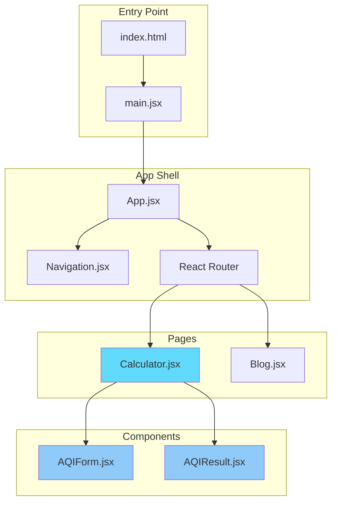
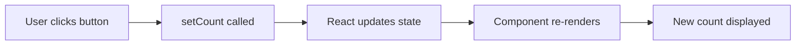
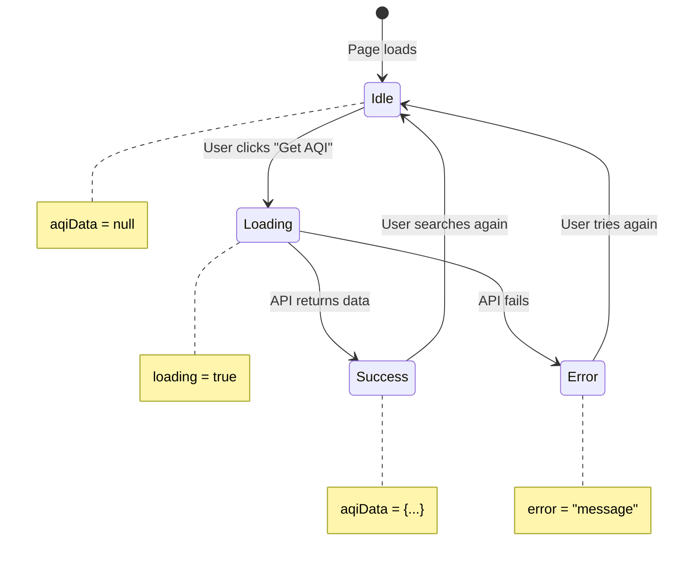
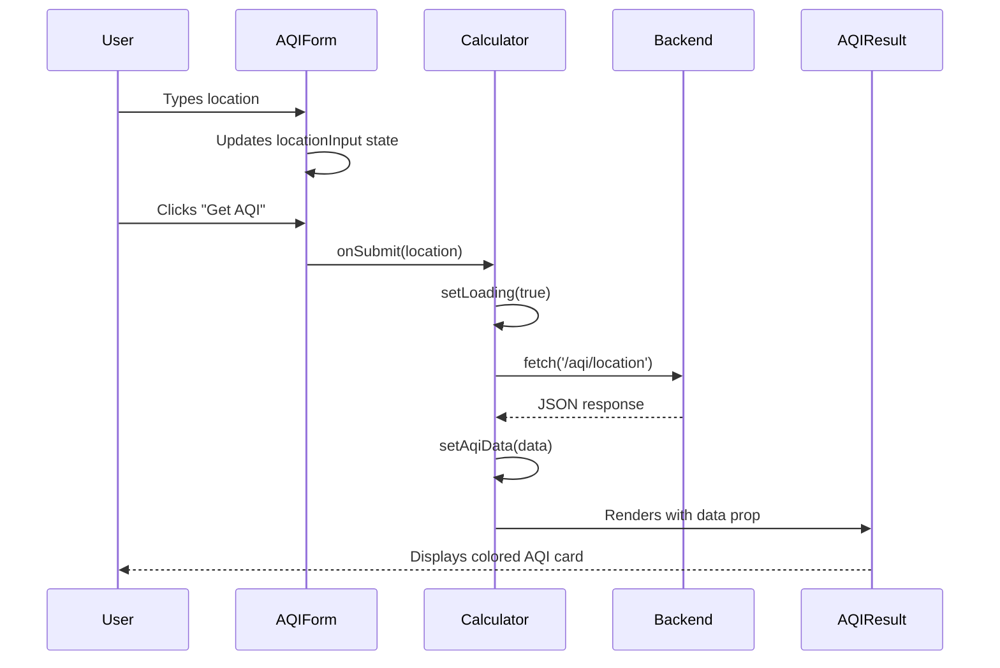

# ⚛️ Frontend - React Application

Welcome to the React frontend! This document explains React concepts, the project structure, and walks through the code.

> **Don't panic!** React looks different from Python, but the concepts are similar. This guide will help you understand.

---

## 📁 File Overview

```
frontend/
├── src/
│   ├── main.jsx           ← Entry point (like if __name__ == "__main__")
│   ├── App.jsx            ← Main component with routing
│   ├── index.css          ← Global styles (Tailwind CSS)
│   ├── pages/
│   │   ├── Calculator.jsx ← Main AQI calculator page
│   │   └── Blog.jsx       ← Blog page
│   └── components/
│       ├── Navigation.jsx ← Top nav bar
│       ├── AQIForm.jsx    ← Location input form
│       └── AQIResult.jsx  ← AQI result display
├── index.html             ← HTML template
├── package.json           ← Dependencies (like requirements.txt)
├── vite.config.js         ← Build tool config
└── tailwind.config.js     ← CSS framework config
```

---

## 🏗️ Architecture



### Component Hierarchy

```
App
├── Navigation (always visible)
└── Routes
    ├── "/" → Calculator
    │         ├── AQIForm (location input)
    │         └── AQIResult (results display)
    └── "/blog" → Blog
```

---

## ⚛️ React Fundamentals

Before reading the code, let's understand the key concepts.

### 1. Components = Functions That Return HTML

```jsx
// This is a React component
function Greeting({ name }) {
    return <h1>Hello, {name}!</h1>
}

// Using it (like calling a function)
<Greeting name="Alice" />  // Renders: <h1>Hello, Alice!</h1>
```

**Python equivalent:**
```python
def greeting(name):
    return f"<h1>Hello, {name}!</h1>"

greeting("Alice")  # Returns: <h1>Hello, Alice!</h1>
```

### 2. Props = Function Arguments

```jsx
// Props are passed like HTML attributes
<AQIResult data={aqiData} loading={false} />

// Inside AQIResult component:
function AQIResult({ data, loading }) {
    // data and loading are now available
    return <div>{data.aqi}</div>
}
```

**Python equivalent:**
```python
def aqi_result(data, loading):
    return f"<div>{data['aqi']}</div>"

aqi_result(data=aqi_data, loading=False)
```

### 3. State = Variables That Update The UI

This is the key difference from regular Python:

```python
# Python - changing variable doesn't update display
count = 0
count = count + 1  # Nothing visible happens
print(count)       # You must explicitly output
```

```jsx
// React - useState creates a "reactive" variable
const [count, setCount] = useState(0)

// When you call setCount, the UI automatically updates!
setCount(count + 1)  // UI shows new value immediately

// Why two values? 
// count = current value (read-only)
// setCount = function to update it
```



### 4. JSX = HTML Inside JavaScript

JSX looks like HTML but it's JavaScript:

```jsx
// Curly braces {} = "insert JavaScript here"
function Welcome({ user }) {
    return (
        <div className="card">
            <h1>Hello, {user.name}!</h1>           {/* Variable */}
            <p>You have {user.messages} messages</p>
            {user.isAdmin && <span>👑 Admin</span>} {/* Conditional */}
        </div>
    )
}
```

**Python f-string comparison:**
```python
f"""
<div class="card">
    <h1>Hello, {user['name']}!</h1>
    <p>You have {user['messages']} messages</p>
    {'<span>👑 Admin</span>' if user['is_admin'] else ''}
</div>
"""
```

### 5. useEffect = Run Code When Component Loads

```jsx
function UserProfile({ userId }) {
    const [user, setUser] = useState(null)
    
    // This runs AFTER the component renders
    useEffect(() => {
        // Fetch user data when component mounts
        fetch(`/api/users/${userId}`)
            .then(res => res.json())
            .then(data => setUser(data))
    }, [userId])  // Re-run if userId changes
    
    return <div>{user ? user.name : 'Loading...'}</div>
}
```

**Python equivalent (conceptually):**
```python
class UserProfile:
    def __init__(self, user_id):
        self.user = None
        self._load_user(user_id)  # Called after init
    
    def _load_user(self, user_id):
        self.user = requests.get(f"/api/users/{user_id}").json()
```

---

## 📖 Code Walkthrough

### Entry Point: `main.jsx`

```jsx
import React from 'react'
import ReactDOM from 'react-dom/client'
import App from './App.jsx'
import './index.css'

// Find the <div id="root"> in index.html and render our app there
ReactDOM.createRoot(document.getElementById('root')).render(
  <React.StrictMode>
    <App />
  </React.StrictMode>,
)
```

**Python equivalent:**
```python
if __name__ == "__main__":
    app = App()
    render(app, target="root")
```

### App Shell: `App.jsx`

```jsx
import { BrowserRouter as Router, Routes, Route } from 'react-router-dom'
import Navigation from './components/Navigation'
import Calculator from './pages/Calculator'
import Blog from './pages/Blog'

function App() {
  return (
    <Router>
      <div className="min-h-screen">
        <Navigation />           {/* Always visible */}
        <Routes>
          <Route path="/" element={<Calculator />} />
          <Route path="/blog" element={<Blog />} />
        </Routes>
      </div>
    </Router>
  )
}

export default App
```

**What this does:**
- Wraps app in `<Router>` for navigation
- Shows `<Navigation>` on every page
- Shows `<Calculator>` when URL is `/`
- Shows `<Blog>` when URL is `/blog`

**Python Flask equivalent:**
```python
@app.route("/")
def calculator():
    return render_template("calculator.html")

@app.route("/blog")
def blog():
    return render_template("blog.html")
```

### Main Page: `Calculator.jsx`

This is where the magic happens!

```jsx
import { useState } from 'react'
import AQIForm from '../components/AQIForm'
import AQIResult from '../components/AQIResult'

const API_URL = import.meta.env.VITE_API_URL || 'http://localhost:8000'

export default function Calculator() {
  // State variables
  const [aqiData, setAqiData] = useState(null)    // API response
  const [loading, setLoading] = useState(false)    // Loading spinner
  const [error, setError] = useState(null)         // Error message

  // Function called when form is submitted
  const handleCalculateAQI = async (formData) => {
    setLoading(true)
    setError(null)
    
    try {
      // Make API call (like requests.post in Python)
      const response = await fetch(`${API_URL}/aqi/location`, {
        method: 'POST',
        headers: { 'Content-Type': 'application/json' },
        body: JSON.stringify({
          latitude: formData.latitude,
          longitude: formData.longitude
        }),
      })
      
      const data = await response.json()
      setAqiData(data)  // Update state → triggers re-render
      
    } catch (err) {
      setError(err.message)
    } finally {
      setLoading(false)
    }
  }

  // Render the UI
  return (
    <div className="container">
      <h1>Air Quality Index</h1>
      
      {/* Form component - calls handleCalculateAQI on submit */}
      <AQIForm onSubmit={handleCalculateAQI} loading={loading} />
      
      {/* Conditional rendering */}
      {loading && <p>Loading...</p>}
      {error && <p className="error">{error}</p>}
      {aqiData && <AQIResult data={aqiData} />}
    </div>
  )
}
```



### Form Component: `AQIForm.jsx`

Handles location input with Google Places autocomplete:

```jsx
function AQIForm({ onSubmit, loading }) {
  const [locationInput, setLocationInput] = useState('')
  const [selectedLocation, setSelectedLocation] = useState(null)
  
  const handleSubmit = (e) => {
    e.preventDefault()  // Prevent page reload
    
    // Call parent's function with location data
    onSubmit({
      latitude: selectedLocation.latitude,
      longitude: selectedLocation.longitude
    })
  }

  return (
    <form onSubmit={handleSubmit}>
      <input
        type="text"
        value={locationInput}
        onChange={(e) => setLocationInput(e.target.value)}
        placeholder="Enter a location..."
      />
      <button type="submit" disabled={loading}>
        {loading ? 'Loading...' : 'Get AQI'}
      </button>
    </form>
  )
}
```

**Key patterns:**
- `onSubmit` prop = callback function from parent
- `e.preventDefault()` = stop form from reloading page
- `onChange` = update state on every keystroke
- `disabled={loading}` = disable button while loading

### Result Component: `AQIResult.jsx`

Displays the AQI data with colors and categories:

```jsx
function AQIResult({ data }) {
  const { aqi, category, color, location, measurements } = data
  
  // Helper function to determine gradient color
  const getAQIGradient = (aqi) => {
    if (aqi <= 50) return 'from-green-400 to-green-600'
    if (aqi <= 100) return 'from-yellow-400 to-yellow-600'
    if (aqi <= 150) return 'from-orange-400 to-orange-600'
    return 'from-red-400 to-red-600'
  }

  return (
    <div className={`bg-gradient-to-r ${getAQIGradient(aqi)}`}>
      <h2>{aqi}</h2>
      <p>{category}</p>
      <p>{location}</p>
      
      {/* Map over array (like Python list comprehension) */}
      <div>
        {measurements.map((m, index) => (
          <div key={index}>
            {m.display_name}: {m.value}
          </div>
        ))}
      </div>
    </div>
  )
}
```

**Array mapping (like Python list comprehension):**
```jsx
// React
{items.map(item => <div key={item.id}>{item.name}</div>)}

// Python equivalent
[f"<div>{item['name']}</div>" for item in items]
```

---

## 🎨 Styling with Tailwind CSS

This project uses Tailwind CSS - utility classes instead of writing CSS:

```jsx
// Instead of writing CSS like this:
// .button { background: blue; padding: 8px 16px; border-radius: 4px; }

// You write classes directly:
<button className="bg-blue-500 px-4 py-2 rounded">
  Click me
</button>
```

**Common Tailwind classes:**
| Class | What it does |
|-------|-------------|
| `bg-blue-500` | Blue background |
| `text-white` | White text |
| `p-4` | Padding all sides |
| `px-4` | Padding left & right |
| `py-2` | Padding top & bottom |
| `rounded` | Rounded corners |
| `flex` | Flexbox container |
| `grid` | Grid container |
| `hover:bg-blue-600` | Blue on hover |

---

## 🔧 Running the Frontend

```bash
cd frontend

# Install dependencies
npm install

# Start development server
npm run dev
```

Opens at http://localhost:3000

### Environment Variables

Create a `.env` file:
```env
VITE_API_URL=http://localhost:8000
VITE_GOOGLE_MAPS_API_KEY=your_key_here  # Optional
```

> ⚠️ **Important**: Vite reads these at **build time**. Restart the dev server after changes!

---

## 📦 Dependencies Explained

| Package | Purpose | Python Equivalent |
|---------|---------|-------------------|
| `react` | UI library | - |
| `react-dom` | Browser rendering | - |
| `react-router-dom` | URL routing | Flask routes |
| `vite` | Build tool & dev server | - |
| `tailwindcss` | CSS utilities | - |

---

## 🔄 Data Flow Summary



---

## 🧪 Try These Exercises

1. **Change a color**: In `AQIResult.jsx`, modify the gradient colors
2. **Add a field**: Display a new field from the API response
3. **Create a component**: Make a `<Spinner />` component for loading states
4. **Add a page**: Create a new route `/about` with an About page

---

## 📚 Next Steps

1. **Understand the backend** → [backend/README.md](../backend/README.md)
2. **React official tutorial** → https://react.dev/learn
3. **Tailwind CSS docs** → https://tailwindcss.com/docs

---

## 🤔 Common Questions

**Q: Why `.jsx` instead of `.js`?**  
A: JSX files contain HTML-like syntax. It's a convention to use `.jsx` for clarity.

**Q: What's `export default`?**  
A: Makes the component available for import. Like `__all__ = ['Calculator']` in Python.

**Q: Why `className` instead of `class`?**  
A: `class` is a reserved word in JavaScript. React uses `className` for CSS classes.

**Q: What's the `key` prop in lists?**  
A: React needs unique keys to track list items efficiently. Always use a unique identifier.
