# ⚛️ Frontend - React Application (aqitoday.in)

Welcome to the React frontend! This document explains React concepts for Python developers, walks through the code, and shows how everything connects.

> **Don't panic!** React looks different from Python, but the concepts are similar. This guide bridges the gap.

---

## 📁 File Overview

```
frontend/
├── src/
│   ├── main.jsx           ← Entry point (like if __name__ == "__main__")
│   ├── App.jsx            ← Main component with routing
│   ├── index.css          ← Tailwind CSS styles
│   ├── contexts/
│   │   └── LocationContext.jsx ← THE BRAIN: shared state + API calls
│   ├── pages/
│   │   ├── Calculator.jsx ← Main page (uses context)
│   │   └── Blog.jsx       ← Blog page
│   └── components/
│       ├── Navigation.jsx ← Search bar + location button
│       ├── AQIResult.jsx  ← Results display (850+ lines!)
│       └── AQIForm.jsx    ← Manual input form
├── index.html             ← HTML template (includes Google Analytics)
├── package.json           ← Dependencies (like requirements.txt)
├── vite.config.js         ← Build tool config
├── tailwind.config.js     ← CSS framework config
└── Dockerfile             ← Container config for deployment
```

### 🎯 Which File Does What?

| File | Lines | Main Job | Key Functions |
|------|-------|----------|---------------|
| `LocationContext.jsx` | ~230 | State management, API calls | `fetchAQI()`, `getCurrentLocation()` |
| `Navigation.jsx` | ~200 | Search bar, location button | Google Places autocomplete |
| `AQIResult.jsx` | ~850 | Display results, share, subscribe | Cigarette calc, share image generation |
| `Calculator.jsx` | ~100 | Page layout, loading/error states | Renders AQIResult + AQIForm |
| `AQIForm.jsx` | ~200 | Manual pollutant input | Form handling, validation |

---

## 🏗️ Architecture

### Component Hierarchy

```mermaid
graph TB
    subgraph "🌐 App Shell"
        APP["App.jsx"]
        APP --> CTX["LocationContext Provider<br/>━━━━━━━━━━━━━━━━<br/>🧠 THE BRAIN<br/>Holds all shared state"]
    end
    
    subgraph "🔝 Always Visible"
        CTX --> NAV["Navigation.jsx<br/>━━━━━━━━━━━━━━━━<br/>🔍 Search bar<br/>📍 My Location button"]
    end
    
    subgraph "📄 Pages (via Router)"
        CTX --> ROUTER["React Router"]
        ROUTER --> |"/"| CALC["Calculator.jsx"]
        ROUTER --> |"/blog"| BLOG["Blog.jsx"]
    end
    
    subgraph "🧩 Components"
        CALC --> RESULT["AQIResult.jsx<br/>━━━━━━━━━━━━━━━━<br/>🎨 AQI display<br/>🚬 Cigarette calc<br/>📤 Share/Subscribe"]
        CALC --> FORM["AQIForm.jsx<br/>━━━━━━━━━━━━━━━━<br/>📝 Manual input"]
    end
    
    style CTX fill:#a855f7,color:#fff
    style NAV fill:#3B82F6,color:#fff
    style RESULT fill:#10B981,color:#fff
```



### Text View

```
App.jsx
└── LocationContext Provider  ← All state lives here
    ├── Navigation.jsx        ← Always visible at top
    │   └── Search bar + Location button
    └── React Router
        ├── "/" → Calculator.jsx
        │   ├── AQIResult.jsx  ← Main results display
        │   └── AQIForm.jsx    ← Manual input option
        └── "/blog" → Blog.jsx
```

---

## 🔄 State Management with Context

### The Problem Context Solves

Without Context, you'd have to pass data through every component (called "prop drilling"):

```mermaid
graph TD
    subgraph "❌ Without Context (Messy!)"
        A1["App"] --> |"location, setLocation,<br/>aqiData, loading..."| B1["Navigation"]
        A1 --> |"same props..."| C1["Calculator"]
        C1 --> |"aqiData, loading..."| D1["AQIResult"]
    end
```

```mermaid
graph TD
    subgraph "✅ With Context (Clean!)"
        CTX["LocationContext<br/>━━━━━━━━━━━━━━━━<br/>Single source of truth"]
        NAV["Navigation"] --> |"useLocation()"| CTX
        CALC["Calculator"] --> |"useLocation()"| CTX
        RESULT["AQIResult"] --> |"useLocation()"| CTX
    end
```





### What's Inside LocationContext


### How Components Use Context

```jsx
// Any component can use the shared state:
function MyComponent() {
  const { aqiData, loading, fetchAQI } = useLocation()
  
  // aqiData has all the AQI info
  // loading tells you if data is being fetched
  // fetchAQI() triggers a new API call
}
```

---

## ⚛️ React Fundamentals (for Python Developers)

Before reading the code, let's translate React concepts to Python.

### 1. Components = Functions That Return HTML


```jsx
// This is a React component - just a function!
function Greeting({ name }) {
    return <h1>Hello, {name}!</h1>
}

// Using it (like calling a function)
<Greeting name="Alice" />  // Renders: <h1>Hello, Alice!</h1>
```

**Python equivalent:**
```python
def greeting(name):
    return f"<h1>Hello, {name}!</h1>"

greeting("Alice")  # Returns: <h1>Hello, Alice!</h1>
```

### 2. Props = Function Arguments

```jsx
// Props are passed like HTML attributes
<AQIResult data={aqiData} loading={false} />

// Inside AQIResult component:
function AQIResult({ data, loading }) {
    // data and loading are now available
    return <div>{data.aqi}</div>
}
```

**Python equivalent:**
```python
def aqi_result(data, loading):
    return f"<div>{data['aqi']}</div>"

aqi_result(data=aqi_data, loading=False)
```

### 3. State = Variables That Trigger Re-renders

This is THE key difference from Python:

```mermaid
graph TB
    subgraph "🐍 Python"
        P1["count = 0"] --> P2["count = count + 1"]
        P2 --> P3["Nothing visible happens!"]
        P3 --> P4["Must print() explicitly"]
    end
```

```mermaid
graph TB
    subgraph "⚛️ React useState"
        R1["const [count, setCount] = useState(0)"] --> R2["setCount(count + 1)"]
        R2 --> R3["React sees state changed"]
        R3 --> R4["Component re-renders automatically!"]
        R4 --> R5["UI shows new value"]
    end
```





```jsx
// useState returns [currentValue, setterFunction]
const [count, setCount] = useState(0)  // Start at 0

// This automatically updates the UI!
setCount(count + 1)
```

**Why two values?**
- `count` = read the current value
- `setCount` = change the value AND trigger re-render

### 4. Context = Shared Global State

```jsx
// Create context (like a global state container)
const LocationContext = createContext()

// Provider wraps app and provides state
function LocationProvider({ children }) {
    const [aqiData, setAqiData] = useState(null)
    
    return (
        <LocationContext.Provider value={{ aqiData, setAqiData }}>
            {children}
        </LocationContext.Provider>
    )
}

// Any child component can use the context
function Calculator() {
    const { aqiData } = useContext(LocationContext)
    return <div>AQI: {aqiData?.aqi}</div>
}
```

**Python equivalent (conceptually):**
```python
# Like a singleton/global object
class LocationContext:
    _instance = None
    
    def __new__(cls):
        if not cls._instance:
            cls._instance = super().__new__(cls)
            cls._instance.aqi_data = None
        return cls._instance

# Any module can access it
ctx = LocationContext()
print(ctx.aqi_data)
```

### 5. JSX = HTML Inside JavaScript

JSX looks like HTML but it's JavaScript:

```jsx
// Curly braces {} = "insert JavaScript here"
function Welcome({ user }) {
    return (
        <div className="card">
            <h1>Hello, {user.name}!</h1>           {/* Variable */}
            <p>You have {user.messages} messages</p>
            {user.isAdmin && <span>👑 Admin</span>} {/* Conditional */}
        </div>
    )
}
```

**Python f-string comparison:**
```python
f"""
<div class="card">
    <h1>Hello, {user['name']}!</h1>
    <p>You have {user['messages']} messages</p>
    {'<span>👑 Admin</span>' if user['is_admin'] else ''}
</div>
"""
```

### 6. useEffect = Run Code After Render

Think of it as "do this when the component loads or when dependencies change":


```jsx
useEffect(() => {
    // This runs AFTER the component renders
    fetch('/api/data')
        .then(res => res.json())
        .then(data => setData(data))
}, [])  // Empty array = run once on mount

useEffect(() => {
    // This runs when userId changes
    fetchUser(userId)
}, [userId])  // Re-run when userId changes
```

---

## 📖 Code Walkthrough

### Entry Point: `main.jsx`

```jsx
import React from 'react'
import ReactDOM from 'react-dom/client'
import App from './App.jsx'
import './index.css'

// Find the <div id="root"> in index.html and render our app there
ReactDOM.createRoot(document.getElementById('root')).render(
  <React.StrictMode>
    <App />
  </React.StrictMode>,
)
```

**Python equivalent:**
```python
if __name__ == "__main__":
    app = App()
    render(app, target="root")
```

### App Shell: `App.jsx`

```jsx
import { BrowserRouter as Router, Routes, Route } from 'react-router-dom'
import { LocationProvider } from './contexts/LocationContext'
import Navigation from './components/Navigation'
import Calculator from './pages/Calculator'
import Blog from './pages/Blog'

function App() {
  return (
    <LocationProvider>        {/* Shared state for all components */}
      <Router>
        <div className="min-h-screen bg-gradient-to-br from-slate-50 via-blue-50 to-indigo-50">
          <Navigation />      {/* Location search always visible */}
          <Routes>
            <Route path="/" element={<Calculator />} />
            <Route path="/blog" element={<Blog />} />
          </Routes>
        </div>
      </Router>
    </LocationProvider>
  )
}

export default App
```

**What this does:**
- Wraps entire app in `<LocationProvider>` for shared state
- Wraps app in `<Router>` for navigation
- Shows `<Navigation>` (with search) on every page
- Shows `<Calculator>` when URL is `/`
- Shows `<Blog>` when URL is `/blog`

### Location Context: `contexts/LocationContext.jsx`

This is the "brain" of the app - it manages all location and AQI state:

```jsx
function LocationProvider({ children }) {
  // Location state
  const [selectedLocation, setSelectedLocation] = useState(null)
  const [locationInput, setLocationInput] = useState('')
  
  // AQI data state  
  const [aqiData, setAqiData] = useState(null)
  const [loading, setLoading] = useState(false)
  const [error, setError] = useState(null)

  // Auto-request location on first load
  useEffect(() => {
    const hasAskedPermission = sessionStorage.getItem('locationPermissionAsked')
    if (!hasAskedPermission && navigator.geolocation) {
      sessionStorage.setItem('locationPermissionAsked', 'true')
      getCurrentLocation()  // Automatically ask for location!
    }
  }, [])

  // Fetch AQI when location is set
  const fetchAQI = async (latitude, longitude) => {
    setLoading(true)
    const response = await fetch(`${API_URL}/aqi/location`, {
      method: 'POST',
      body: JSON.stringify({ latitude, longitude }),
    })
    const data = await response.json()
    setAqiData(data)
    setLoading(false)
  }

  // Provide state to all children
  return (
    <LocationContext.Provider value={{ 
      selectedLocation, setSelectedLocation,
      aqiData, loading, error,
      getCurrentLocation, fetchAQI 
    }}>
      {children}
    </LocationContext.Provider>
  )
}
```


### Navigation Component: `components/Navigation.jsx`

The navigation bar contains the location search - always accessible:

```jsx
function Navigation() {
  const { 
    selectedLocation, 
    setSelectedLocation, 
    locationInput, 
    setLocationInput,
    getCurrentLocation,
    loading 
  } = useLocation()  // Get state from context
  
  // Google Places autocomplete for search
  const handleSelectPrediction = async (prediction) => {
    const place = new window.google.maps.places.Place({ id: prediction.placeId })
    await place.fetchFields({ fields: ['location'] })
    
    // This triggers AQI fetch via context
    setSelectedLocation({
      name: prediction.description,
      latitude: place.location.lat(),
      longitude: place.location.lng()
    })
  }

  // Auto-clear input on focus for better UX
  const handleInputFocus = () => {
    setLocationInput('')
    setSelectedLocation(null)
  }

  return (
    <nav className="...">
      {/* Logo - aqitoday.in with wind/air icon */}
      <Link to="/">
        <div className="w-9 h-9 bg-gradient-to-br from-indigo-500 to-purple-600 rounded-xl">
          <svg className="w-5 h-5 text-white" fill="none" stroke="currentColor" viewBox="0 0 24 24">
            {/* Wind/Air icon representing air quality */}
            <path strokeLinecap="round" strokeLinejoin="round" strokeWidth={2} d="M14 5l7 7m0 0l-7 7m7-7H3" />
          </svg>
        </div>
        <span>aqitoday.in</span>
      </Link>
      
      {/* Search bar with auto-clear on focus */}
      <input 
        value={locationInput}
        onChange={(e) => setLocationInput(e.target.value)}
        onFocus={handleInputFocus}  // Clears input when clicked
        placeholder="Search location..."
      />
        onChange={(e) => setLocationInput(e.target.value)}
        placeholder="Search location..."
      />
      
      {/* My Location button */}
      <button onClick={getCurrentLocation}>
        Use My Location
      </button>
      
      {/* Selected location indicator */}
      {selectedLocation && (
        <span>{selectedLocation.name}</span>
      )}
    </nav>
  )
}
```

### Calculator Page: `pages/Calculator.jsx`

The main page - now much simpler because state is in context:

```jsx
function Calculator() {
  const { aqiData, loading, error, locationPermission } = useLocation()

  return (
    <div className="min-h-screen">
      {/* Show hero when no data */}
      {!aqiData && !loading && !error && (
        <div className="text-center">
          <h1>Check Your Air Quality</h1>
          {locationPermission === 'denied' && (
            <p>Location denied. Use search bar above.</p>
          )}
        </div>
      )}

      {/* Loading state */}
      {loading && <LoadingSpinner />}

      {/* Error state */}
      {error && <ErrorMessage message={error} />}

      {/* Results */}
      {aqiData && !loading && <AQIResult data={aqiData} />}
    </div>
  )
}
```

### Result Component: `components/AQIResult.jsx`

Displays the AQI data with a clean, uncluttered design:

```jsx
function AQIResult({ data }) {
  const [isPollutantsExpanded, setIsPollutantsExpanded] = useState(false)
  const { aqi, category, location, message, pollutant_breakdown, forecast, dominant_pollutant } = data

  // Calculate cigarette equivalent (22 µg/m³ PM2.5 ≈ 1 cigarette)
  const cigarettes = getCigaretteEquivalent(aqi)

  return (
    <div className="bg-white rounded-2xl shadow-lg">
      {/* Compact Header with AQI */}
      <div className="p-5 bg-light-colored">
        <div className="flex items-center gap-4">
          {/* AQI Circle */}
          <div className="w-24 h-24 rounded-full" style={{ backgroundColor: colors.bg }}>
            <span className="text-4xl font-black">{aqi}</span>
          </div>
          
          {/* Status & Location */}
          <div>
            <div>{getAQIEmoji(aqi)} {category}</div>
            
            {/* Station info - Shows "Based on monitoring station closest to you" */}
            <div>
              <span>📍 Based on the monitoring station closest to you</span>
              {/* Station name displayed below */}
              {location && <div className="font-medium">{location}</div>}
            </div>
          </div>
        </div>
      </div>

      {/* Info Grid - Visible by default */}
      <div className="p-5 space-y-4">
        {/* Cigarette Equivalent & Main Pollutant with Animated Smoke */}
        <div className="grid grid-cols-2 gap-3">
          <div>🚬 {cigarettes} cigarettes/day</div>
          <div>💨 Main Pollutant: {dominant_pollutant}</div>
        </div>

        {/* Health Advice */}
        <div>💡 {message}</div>

        {/* Forecast - Always visible */}
        {forecast && <div>📅 Forecast: ...</div>}

        {/* Collapsible "Explore Pollutants" Section */}
        {pollutant_breakdown && (
          <div>
            <button onClick={() => setIsPollutantsExpanded(!isPollutantsExpanded)}>
              🔍 Explore Pollutants
            </button>
            
            {isPollutantsExpanded && (
              <div className="grid grid-cols-3 gap-3">
                {Object.entries(pollutant_breakdown).map(([name, value]) => (
                  <div key={name}>{name}: {value}</div>
                ))}
              </div>
            )}
          </div>
        )}
      </div>

      {/* Pollutant Level Indicator - Left as is */}
      <div className="px-5 pb-5">
        <div className="flex rounded-lg h-2">
          <div className="flex-1 bg-emerald-500"></div>
          <div className="flex-1 bg-amber-500"></div>
          <div className="flex-1 bg-red-500"></div>
          {/* ... more colors ... */}
        </div>
      </div>
    </div>
  )
}
```

**Recent UX Improvements:**
- **Station information**: Now clearly shows "Based on the monitoring station closest to you" with the actual station name displayed prominently
- **Animated smoke icon**: The main pollutant section features an animated smoke emoji (💨) for visual appeal
- **Collapsible pollutants**: The detailed pollutant breakdown is hidden by default in a collapsible "Explore Pollutants" section to reduce clutter
- **Key info visible**: AQI value, cigarettes equivalent, main pollutant, and forecast remain visible by default
- **Clean design**: Focuses on the most important information first, with additional details available on demand

---

## 🔄 Complete Data Flow

### User Opens App → Sees AQI


### User Searches Location


---

## 🎨 Understanding AQIResult.jsx (The Big One!)

This is the largest component (~850 lines) because it does a lot:

```mermaid
graph TB
    subgraph "🎨 AQIResult.jsx Features"
        direction TB
        
        subgraph "Display"
            D1["AQI Circle<br/>(color-coded)"]
            D2["Category + Emoji<br/>(Good 😊 to Hazardous ☠️)"]
            D3["Station Info<br/>+ Distance"]
        end
        
        subgraph "Calculations"
            C1["🚬 Cigarette Equivalent<br/>(Berkeley Earth formula)"]
            C2["⭐ Confidence Score<br/>(distance + freshness)"]
            C3["💡 Health Actions<br/>(based on AQI level)"]
        end
        
        subgraph "User Features"
            U1["📤 Share Menu<br/>(WhatsApp, Twitter, etc)"]
            U2["🖼️ Generate Share Image<br/>(Canvas API)"]
            U3["📧 Subscribe Modal<br/>(email/phone alerts)"]
            U4["⭐ Feedback Modal<br/>(star rating)"]
        end
    end
```



### Key Calculations

**Cigarette Equivalent:**
```jsx
// Based on Berkeley Earth research: 22 µg/m³ PM2.5 ≈ 1 cigarette
const getCigaretteEquivalent = (aqi) => {
  // Convert AQI back to approximate PM2.5
  let pm25
  if (aqi <= 50) pm25 = (aqi / 50) * 12
  else if (aqi <= 100) pm25 = 12 + ((aqi - 50) / 50) * 23.4
  // ... more breakpoints
  
  return Math.round((pm25 / 22) * 10) / 10
}
```

**Confidence Score:**
```jsx
const getConfidenceLevel = () => {
  const distanceOk = distance_km <= 5        // Station within 5km
  const freshOk = freshnessMins < 60         // Data < 1 hour old
  
  if (distanceOk && freshOk) return 'High'   // 🟢
  if (distanceOk || freshOk) return 'Medium' // 🟡
  return 'Low'                                // 🔴
}
```

---

## 🔧 Running the Frontend

```bash
cd frontend

# Install dependencies
npm install

# Start development server
npm run dev
```

Opens at http://localhost:3000

### Environment Variables

Create a `.env` file:
```env
VITE_API_URL=http://localhost:8000
VITE_GOOGLE_MAPS_API_KEY=your_key_here  # Optional
```

> ⚠️ **Important**: Vite reads these at **build time**. Restart the dev server after changes!

---

## 📦 Dependencies Explained

| Package | Purpose | Python Equivalent |
|---------|---------|-------------------|
| `react` | UI library | - |
| `react-dom` | Browser rendering | - |
| `react-router-dom` | URL routing | Flask routes |
| `vite` | Build tool & dev server | - |
| `tailwindcss` | CSS utilities | - |

---

## 🧪 Try These Exercises

1. **Change a color**: In `AQIResult.jsx`, modify the gradient colors
2. **Add a field**: Display a new field from the API response
3. **Create a component**: Make a `<Spinner />` component for loading states
4. **Modify the context**: Add a new piece of state (e.g., `favoriteLocations`)

---

## 📚 Next Steps

1. **Understand the backend** → [backend/README.md](../backend/README.md)
2. **React official tutorial** → https://react.dev/learn
3. **Tailwind CSS docs** → https://tailwindcss.com/docs

---

## 🤔 Common Questions

**Q: Why `.jsx` instead of `.js`?**  
A: JSX files contain HTML-like syntax. It's a convention to use `.jsx` for clarity.

**Q: What's `export default`?**  
A: Makes the component available for import. Like `__all__ = ['Calculator']` in Python.

**Q: Why `className` instead of `class`?**  
A: `class` is a reserved word in JavaScript. React uses `className` for CSS classes.

**Q: What's the `key` prop in lists?**  
A: React needs unique keys to track list items efficiently. Always use a unique identifier.

**Q: Why use Context instead of props?**  
A: Context avoids "prop drilling" - passing data through many component layers. It's like having a global variable that components can subscribe to.
